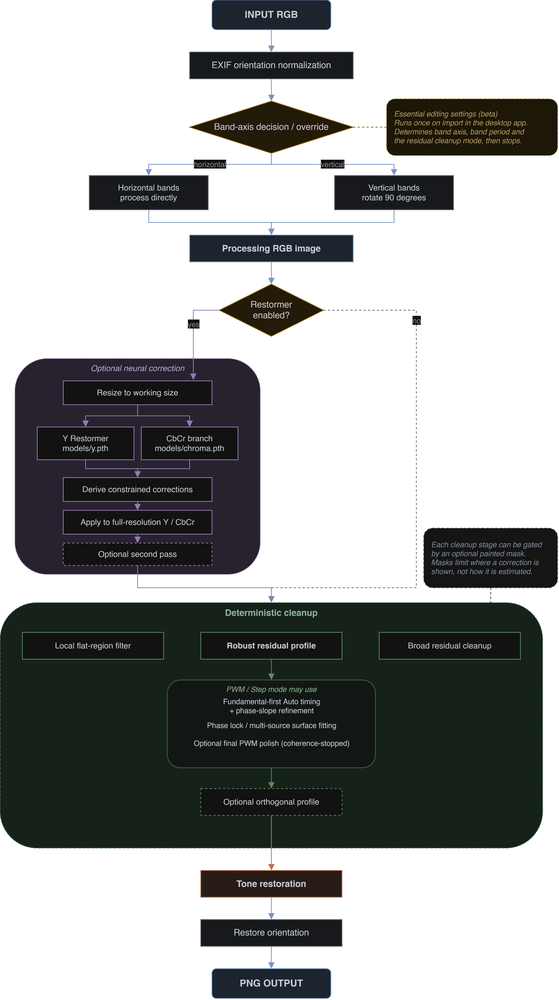

# Flicker Suppressor - Architecture, GUI, and Command Reference

This document describes the release architecture in depth, documents every option accepted by `hybrid_infer_detail_preserving.py`, and records the current desktop GUI workflow and processing policy.

## 1. Problem definition

Rolling-shutter flicker occurs when a sensor exposes/readouts different rows at different times while an artificial light source changes intensity or spectral balance during the frame. In a displayed image the artifact usually appears as broad or fine bands. Depending on camera orientation, the visible bands may be horizontal or vertical.

Flicker Suppressor treats the problem as a combination of three separable tasks:

1. **luminance restoration** - estimate the illumination correction without replacing fine scene detail;
2. **chrominance restoration** - remove row-dependent Cb/Cr casts without letting the chroma branch alter luminance;
3. **deterministic residual cleanup** - optionally suppress remaining band structure using geometry-aware image processing rather than asking the neural network to reconstruct the whole image again.

The system is intentionally modular. A difficult case can receive stronger residual cleanup without retraining either neural model.

---

## 2. High-level architecture



The neural networks operate at the configurable processing resolution. Their output is primarily treated as an **estimate of correction**, which is then resized and applied to the original-resolution image. This is a key design choice for preserving detail.

The Restormer stage is optional. With `--no-restormer`, the model files are not loaded and no neural inference runs; the oriented source image is passed directly to the deterministic cleanup stages. This is useful for PWM cases where the neural model contributes little useful band correction or alters unrelated image content. Residual PWM timing can be estimated from the image itself, while neural correction fields are used only as optional timing/validation evidence when they exist.

In the desktop GUI, Flat-region cleanup, Residual profile, and Broad residual cleanup can each have an optional painted mask. These masks are **final application gates**, not alternate estimators: the automatic stage can still analyze the complete image, but its visible delta is multiplied by the user mask before it reaches the output. This keeps period/surface estimation stable while guaranteeing that authored masks restrict where the corresponding cleanup is shown.

---

## 3. Neural model architecture

Both branches use the reduced Restormer configuration inherited from the BurstDeflicker baseline:

```text
base dimension:          32
encoder/latent blocks:   (2, 3, 4, 5)
attention heads:         (1, 2, 4, 8)
refinement blocks:       2
FFN expansion factor:    2.66
LayerNorm:               WithBias
input channels:          3
```

### 3.1 Luminance branch - `models/y.pth`

The luminance checkpoint is still a 3-channel RGB Restormer. Flicker Suppressor does **not** simply accept its final RGB image. Instead:

1. the model predicts a candidate restored RGB image at the processing resolution;
2. that prediction is converted to YCbCr;
3. only its **Y** channel is used;
4. a luminance correction field is computed between input Y and predicted Y;
5. the correction field is directionally constrained;
6. that field is applied to the original full-resolution Y.

This allows the neural model to estimate the flicker correction while the original image supplies the high-frequency scene detail.

### 3.2 Chroma branch - `models/chroma.pth`

The dedicated chroma branch shares the Restormer trunk but has a **two-channel output head**. Its outputs are centered Cb and Cr, not RGB.

At inference:

```text
Delta CbCr = predicted CbCr - input CbCr
```

The delta is resized to full resolution and added to the original Cb/Cr. Because this branch never outputs Y, it has no direct path to brighten or darken the final image.

### 3.3 Why the branches are separate

Earlier unified RGB experiments showed two recurring problems:

- a chroma-specialized RGB model could overcorrect luminance;
- a luminance band could trigger a false blue/cyan chroma correction, even in grayscale images.

Separating Y and CbCr prevents the first failure structurally and greatly reduces the second.

---

## 4. Color representation and gamut-safe recombination

Flicker Suppressor uses full-range BT.601-style YCbCr math:

```text
Y  =  0.299000 R + 0.587000 G + 0.114000 B
Cb = -0.168736 R - 0.331264 G + 0.500000 B
Cr =  0.500000 R - 0.418688 G - 0.081312 B
```

Cb and Cr are stored zero-centered, so neutral gray has Cb=Cr=0.

A corrected Y/Cb/Cr triplet can sometimes imply RGB values outside `[0,1]`. Naively clipping RGB would change luminance. Flicker Suppressor therefore uses a gamut-safe conversion that reduces chroma toward neutral only where needed while preserving the requested Y as closely as numerical precision allows.

The console reports the percentage of pixels that needed this chroma compression as `gamut-compressed=...%`.

---

## 5. Detail-preserving luminance correction

The default `--luma-mode directional` uses a stabilized log-gain field:

```text
g_raw = log((Y_pred + eps) / (Y_input + eps))
```

with `eps=0.02` by default. The field is clipped to a maximum number of exposure stops, then horizontally smoothed. The default horizontal smoothing sigma is 16 model-resolution pixels.

The physical assumption is that rolling-shutter bands are coherent across much of each sensor row, whereas real scene texture varies locally across X. Smoothing the **correction field**, instead of smoothing the image, removes texture contamination from the network correction.

The filtered gain is resized to the original image size and applied as:

```text
Y_out = (Y_original + eps) * exp(strength * g_filtered) - eps
```

### Row anchoring

With the default row anchor, horizontal filtering preserves the mean correction of each row. This keeps the directional constraint from weakening the overall correction the neural model estimated for that row.

### Alternative Y modes

- `raw` - legacy additive neural correction with no directional constraint;
- `directional` - default log-gain correction, horizontally constrained;
- `directional-additive` - same idea but using additive Delta Y instead of log gain;
- `row` - one robust weighted correction value per row.

`directional` is the recommended general mode.

---

## 6. Optional Restormer stage, pass strengths, and exposure lock

The CLI parser enables the neural stage by default for backward compatibility and it can be disabled with:

```powershell
--no-restormer
```

When disabled, neither `models/y.pth` nor `models/chroma.pth` is loaded, `--passes` is not executed, and deterministic cleanup starts from the oriented source image. In the GUI, **Enable Restormer correction** provides the same switch and is **off by default for new images and after a settings reset**. Restormer-only controls are greyed out while it is disabled. **Band direction** intentionally remains enabled because residual/profile/broad cleanup still needs the same orientation. The CLI default remains on.

When Restormer is enabled, The first pass now has independent visible authority controls:

```powershell
--first-pass-luma-strength 1.0 `
--first-pass-chroma-strength 1.0
```

Both are constrained to `0-2`. The legacy global `--luma-strength` and `--chroma-strength` remain compatibility multipliers; on pass 1 the effective authority is the global value multiplied by the corresponding new first-pass slider. This lets a case keep useful neural chroma correction while reducing neural luminance, or vice versa.

`--passes 2` feeds the first restored result through the neural pipeline a second time. The pass-1 sliders do **not** change pass 2. Pass 2 keeps the historical shared control:

```powershell
--passes 2 `
--second-pass-strength 0.70
```

A naive second pass can accumulate a global luminance shift. The CLI default `--exposure-lock pass2` removes the global DC component from the second Y correction before it is applied. The desktop GUI hides Exposure lock and forces `exposure_lock = all`, applying the DC lock to either neural pass.

### 6.1 Tone restoration

The neural passes compress the tonal range. Shadows are lifted and highlights are pulled down, so the processed image is globally flatter than the source even when the exposure/DC component is locked. This is a change to the tone curve rather than to any band, which means none of the band-focused cleanup stages can see it or repair it.

Tone restoration runs at the end of the pipeline, after all cleanup stages and before orientation is restored. It measures the tone of the processed image against the tone of the original oriented source and applies a monotone correction that puts the contrast and gamma back.

**Fitting on envelopes.** Both sides of the comparison are smoothed along the band axis before the tone curve is fitted, so the flicker itself does not contaminate the measurement. Matching against a still-banded reference would fold band structure into the tone curve.

**Applying in log space.** The correction is applied as a smooth additive offset to log luminance:

```text
delta   = log(mapped_envelope + eps) - log(envelope + eps)
delta   = smooth_along_band(delta)
output  = exp(log(processed + eps) + delta) - eps
```

Because `log(output + eps)` equals `log(processed + eps)` plus a field that carries no band-frequency content, the periodic residual passes through unchanged. This matters: a tone curve applied directly to full-resolution luminance is non-linear, and re-expands the very bands the earlier stages removed.

**Highlight headroom.** Positive corrections are limited by the luminance still available before clipping, using the same limiter the residual profile stage applies. Restoring contrast raises luminance, and without the limiter a bright light source is pushed past `1.0` and flattened into a featureless white disc.

**Band period.** When a validated band period is available, it is used for the envelope smoothing. When it is not, the stage falls back to no band smoothing, which is safe but slightly less precise: the tone fit is then made on unsmoothed luminance.

GUI controls under **Tone restoration**:

- **Tone restoration** - on by default;
- **Restoration strength** - default `1.00`, range `0-1`. At `1.00` the output tone matches the source most closely; lower values apply a proportionally smaller correction.

CLI equivalents are `--tone-restore` / `--no-tone-restore` and `--tone-restore-strength`. Two further options exist but are not exposed in the GUI: `--tone-restore-max-gain` is a safety clamp that ordinary images do not approach, and `--tone-restore-min-confidence` selects which period the envelope smoothing uses rather than whether the stage runs.

---

## 7. Band-axis normalization

The trained models and deterministic filters are fundamentally row-oriented: they expect visible horizontal bands that vary over Y.

### Auto mode

`--band-axis auto` uses image geometry as its primary physical prior:

- portrait H/W >= 1.10 -> treat visible bands as vertical and rotate internally;
- landscape H/W <= 1/1.10 -> native horizontal processing;
- near-square -> use a coarse row-vs-column striping score.

This is based on the idea that physically rotating the camera rotates sensor rows in the displayed image.

### Manual modes

```text
horizontal  process directly
vertical    rotate 90 degrees, process, rotate back
both        horizontal primary restoration + vertical profile-only cleanup
```

Use manual override when a file was cropped or rotated after capture and Auto chooses the wrong orientation.

Orthogonal cleanup is enabled explicitly with `--orthogonal-profile`. It does not run the neural models twice: it keeps the primary restoration and applies only the texture-preserving residual-profile algorithm in the perpendicular axis. The legacy `--band-axis both` CLI value remains as a compatibility shortcut for horizontal primary processing plus orthogonal cleanup.

---

## 8. Optional local flat-region filter

Enable with:

```powershell
--flat-filter
```

This filter does **not** paste a blurred wall over the image. It estimates a row-coherent correction and blends only that correction into safe regions.

The GUI exposes the two local correction strengths directly: **Flat luminance strength** defaults to `0.70` and **Flat chroma strength** defaults to `0.85`. The legacy CLI-only `--flat-cleanup-strength` multiplier remains at `1.0` for backward compatibility but is not a GUI control.

### 8.1 Fine/coarse surface masks

The filter estimates low-detail regions while discounting row-coherent structure that may itself be flicker. A fine mask protects texture; a coarse preblurred mask allows mildly textured but broadly uniform surfaces to participate.

### 8.2 Edge-conductive estimation and row-coherent correction regularization

Dark objects must not contaminate nearby wall estimates. The local stage therefore uses masked normalized estimation, so excluded pixels do not directly contribute to the correction field. Earlier versions still had an important weakness: a wide vertical Gaussian could *bridge across* excluded edge rows. A real horizontal wall moulding, furniture boundary, or other scene structure could therefore be treated as if it were residual flicker, especially when foreground people interrupted the surface.

The current local estimator is **edge-conductive along Y**. It uses the existing soft scene-edge support as a propagation conductivity: evidence travels normally inside a smooth surface, but is progressively attenuated when the estimator crosses a strong real scene boundary. This avoids both failure modes of the earlier approaches: ordinary masked Gaussian smoothing could bridge across real edges, while hard segmentation could create visible seams. The operation is applied only while estimating the correction field; the source image is never blurred.

After that edge-aware estimate, the local stage can horizontally regularize the estimated **correction field**. This follows the physical assumption that rolling-shutter band correction should be coherent across a substantial part of each sensor row. For normal displayed horizontal bands, the default correction-field sigma is 128 full-resolution pixels and can be disabled for regression comparison with `--flat-local-correction-horizontal-sigma 0`.

For **displayed vertical bands**, the image is rotated into the row-oriented processing domain. In that orientation the same 128 px processing-X regularizer would map back into long displayed-Y smearing and can turn bright ceiling lights or other elongated fixtures into visible vertical streaks. Flicker Suppressor therefore bypasses this first correction-field regularizer automatically when the resolved band direction is vertical. The later post-blend regularizer remains active.

The local safety mask also includes a broad **structure-density guard**. Long high-contrast fixtures, frames, moulding, and similar dense edge regions are softly suppressed from the visible local correction so fragmented flat support around those structures cannot imitate a band. Open flat surfaces remain eligible.

A second **broad/defocus structure guard** handles the opposite failure mode: real boundaries that are so out of focus that their per-pixel gradient is too weak for the ordinary edge detector. The image is inspected at a broader scale and the gradient is scale-normalized, so a blurred head, wall panel, or moulding transition can still block local flattening while faint post-neural rolling bands normally remain eligible. This guard affects only the local flat-region stage; it does not reduce the texture-tolerant residual-profile support.

A second horizontal regularization is applied **after the visible local blend mask has been multiplied into the correction**. This prevents a protected person/object from becoming an abrupt hole in a row-varying correction field. Its default sigma is 48 full-resolution pixels and it can be disabled with `--flat-local-application-horizontal-sigma 0`.

### 8.3 Local same-surface safety

To prevent smooth skin or small objects from being mistaken for a wall, local flattening also requires:

- large-surface extent;
- broad Lab-lightness/CbCr color consistency;
- a high large-window same-surface fill ratio;
- sufficient distance from strong scene/object edges.

These affect the **visible local blend**, not the global profile stage.

### 8.4 Tone gate

The default flat-filter window protects deep shadows and highlights using CIE Lab lightness equivalents:

```text
dark midpoint:   #232323
bright midpoint: #efefef
```

Use hashless values in PowerShell:

```powershell
--flat-highpass 232323 `
--flat-lowpass efefef
```

The transitions are smooth rather than hard. The base lightness estimate is also made band-resistant so a dark flicker trough does not automatically disqualify an otherwise valid wall pixel.

---

## 9. Robust residual profile filter

Enable with:

```powershell
--flat-profile
```

This stage is different from the local flattener. It is designed for globally coherent residual bands even when the scene is textured. It can run with or without Restormer and independently of `--flat-filter`.

Residual Profile has two waveform modes:

- **Smooth periodic** (`--flat-profile-mode smooth`) for sinusoidal/rounded residuals. It keeps the established harmonic-aware period estimator, slowly varying adaptive amplitude, surface handoff, and band-coherent no-harm validation.
- **PWM / Step** (`--flat-profile-mode pwm`) for strobed/PWM LEDs with square-ish plateaus, sharp transitions, or a strong harmonic family. PWM mode uses a separate timing/fitting system described below.

### 9.1 Fundamental-first PWM Auto period

The PWM detector does not rely on ordinary image-spectrum power alone. It builds a scene-resistant signed transition signal by lightly smoothing texture, differentiating along the band direction, robustly normalizing each perpendicular column/row, and taking a cross-scene median. A real rolling-shutter PWM transition repeats across much of the frame; an object edge usually remains a minority event.

Auto period then computes positive-lag autocorrelation on that transition signal. Dense straight PWM can produce an almost flat ladder of excellent peaks at `P`, `2P`, `3P`, ... and very large lags. The current **fundamental-first** rule therefore does not blindly take the absolute largest peak. When local maxima are nearly tied, it prefers the shortest candidate that:

- is within roughly 1.5% of the best autocorrelation score;
- still gives at least five visible cycles in the frame;
- contains two opposite recurrent transition phases compatible with the configured PWM duty limits.

This prevents a real fine fundamental from being replaced by an arbitrary large harmonic/autocorrelation plateau. Broad PWM with only a few visible cycles is intentionally not forced down to an unsupported short period.

A manual `--flat-profile-band-period` remains exact. Auto-only refinement never rescales a user-supplied manual period.

### 9.2 Optional Restormer timing evidence

When Restormer is enabled, PWM mode also receives the **cumulative source -> post-neural** log-luminance gain and Cb/Cr delta. This fixes the earlier two-pass problem where using only the final pass could discard the stronger first-pass timing evidence. The neural correction is used as timing/validation evidence; its magnitude is not blindly copied into the final cleanup.

If Restormer is disabled, or if its PWM-frequency energy is weak, the image-side residual transition detector remains sufficient for the direct PWM paths. This is an intentional supported workflow rather than an error condition.

### 9.3 Single-source phase lock

For a dominant PWM family, Flicker Suppressor checks whether the same fundamental phase recurs across several widely separated perpendicular scene strips. When phase coherence is very strong, the period is refined locally for maximum cross-scene phase agreement and the correction enters **phase-locked mode**:

- one global period/phase is frozen for the whole sensor axis;
- radiometrically coherent regions may have different local amplitudes;
- regions are not allowed to invent unrelated local phases;
- local fields are validated against held-out/independent evidence before gaining authority.

This is especially useful when a single lamp produces straight bands over wall, skin, clothing, and other surfaces whose visible PWM amplitude differs because of brightness/color/camera response.

### 9.4 Multiple PWM sources

If the image contains evidence for more than one independent timing family, PWM mode can discover additional candidates from multi-region timing/spectral evidence. Small-integer harmonic-related candidates are grouped so one square wave is not falsely reported as several lamps. Independent validated period families are represented jointly with harmonic sine/cosine bases and fitted over radiometric regions, allowing different surfaces to carry different source mixtures.

This supports cases where multiple LED sources have different periods, band widths, phases, or spatial influence. It remains conservative when the single image cannot separate the sources: exact harmonic relationships, too few visible cycles, heavy clipping, or real scene structure at the same timing can be fundamentally ambiguous.

### 9.5 Surface/cycle fallback models and no-harm policy

When the strongest phase-lock conditions do not hold, PWM mode can fall back through global cycle consensus, held-out surface-conditioned fitting, segmented multi-source fitting, and conservative direct step/smooth paths. The key safety policy is hierarchical: a local model must explain recurrent PWM structure better than a safer parent model; otherwise authority shrinks or falls back rather than forcing a correction.

Cb and Cr share the timing family but keep independent signed channel amplitudes. Luminance is modeled in a log-like domain where practical because illumination flicker is closer to multiplicative than additive. Positive corrections near bright highlights are headroom-limited.

### 9.6 Optional final PWM polish

The optional final polish is a **post-residual projection**, not a new detector:

```powershell
--flat-profile-pwm-polish `
--flat-profile-pwm-polish-strength 1.0 `
--flat-profile-pwm-polish-passes 2
```

It runs after the main Residual profile and local flat cleanup, reusing **only period families already validated by the main PWM stage**. It measures remaining exact PWM-mode energy, fits a constrained surface-aware residual field, and performs an internal authority search. A candidate pass is accepted only if the validated PWM-mode energy decreases and nearby control frequencies do not increase excessively.

**Stopping criterion.** The loop stops when the remaining residual is no longer phase-coherent with the band. Coherence is measured against the band's own phase, so it distinguishes a residual still in phase with the band - which further passes can remove - from one already driven past zero, which further passes would only invert. Energy magnitude cannot make that distinction: it reports the same value either way, so a magnitude-based stop keeps running after the band is gone and buys apparent progress by overshooting.

Because the stage stops on evidence, the configured maximum is an upper bound rather than a value that needs tuning per image. Raising it does not make the polish more aggressive on an image that has already converged.

GUI controls:

- **Enable final PWM polish** - default off;
- **PWM polish strength** - default `1.00`, range `0-1.25`;
- **PWM polish max passes** - default `2`, range `1-6`. This is a ceiling; the stage stops earlier when the residual stops being a band.

The Residual paint mask also gates the visible polish correction. In the desktop GUI, Final PWM polish is available only when **PWM / Step** is selected. The polish checkbox, strength, and max-pass controls are disabled/greyed out in **Smooth periodic** mode; switching back to PWM mode makes them available again without changing the stored checkbox value.

---

## 10. Broad residual cleanup

Enable the stage with:

```powershell
--flat-surface-equalizer
```

The stage has two algorithms selected by `--flat-surface-equalizer-mode`. The desktop GUI exposes the same choice as **Broad mode**. The current default is **`consensus` / Multi-surface consensus**. `dominant` remains available explicitly for the original one-large-surface behavior. Existing saved JSON files that explicitly contain `"flat_surface_equalizer_mode": "dominant"` keep that saved choice.

### 10.1 Dominant surface mode

```powershell
--flat-surface-equalizer `
--flat-surface-equalizer-mode dominant
```

This is the original broad/few-cycle equalizer. It is for a large wall or other one dominant color-consistent surface where ordinary frequency separation cannot clearly distinguish flicker from real illumination. It finds one dominant surface, measures robust Y/Cb/Cr values per processing row, fits a low-order polynomial baseline, and treats departures from that baseline as residual flicker. The correction is feathered only over the selected surface.

### 10.2 Multi-surface consensus mode

```powershell
--flat-surface-equalizer `
--flat-surface-equalizer-mode consensus
```

This mode targets a different failure case: a very broad residual is visible with the same phase across multiple unrelated surfaces, while no single dominant-surface segmentation is trustworthy enough to describe the whole artifact. It is specifically allowed to handle **sub-cycle / single-trough** residuals where less than one complete flicker period is visible inside the frame.

With Restormer enabled, the preferred implementation is **neural-guided for both luminance and chroma**. Before deterministic cleanup, Flicker Suppressor derives the cumulative full-resolution neural log-luminance gain and cumulative Cb/Cr delta between the oriented source and the post-neural image. With Restormer disabled, luminance consensus falls back to image-only cross-region agreement; consensus chroma is conservatively disabled because the current vector-direction validator requires a neural Cb/Cr hint. Those neural corrections are not blindly reapplied. When present they are used only as validation evidence: in the row-oriented processing domain the image is divided into several large independent processing-X regions, each region receives its own robust row measurement and its own affine Y/CbCr baseline, and a common broad residual must be found in multiple widely separated regions. In the neural-guided luminance path the residual must oppose the neural gain, which is the signature of a broad under-correction. The image-only luminance fallback instead relies on cross-region waveform agreement and bounded no-harm authority. Guided chroma uses the magnitude of the two-channel vector correlation with the neural Cb/Cr change, because a remaining color cast can represent either under-correction or an overshot/model-introduced shift; the accepted scene regions must still agree positively with one another before any chroma correction is allowed.

Once validation passes, the broad residuals from the agreeing regions are robustly combined into row-coherent Y and Cb/Cr waveforms. Luminance and chroma receive separate least-squares no-harm fits. **Broad luminance strength** and **Broad chroma strength** are maximum authorities; consensus mode does not intentionally overshoot either fitted minimum-energy amplitude. The chroma fit treats Cb and Cr as one two-dimensional vector and uses one scalar authority for the shared vector waveform, so it cannot independently overdrive one channel and rotate the estimated hue shift. Near-white pixels also receive a positive-luminance headroom guard so broad recovery does not turn windows or specular highlights into clipped white slabs.

After a primary luminance consensus has been accepted, the stage performs at most **one automatic residual refinement pass**. It re-measures the already-corrected image using the validated first-pass waveform as a template, so it cannot invent a new broad pattern. Because the first pass has already established cross-surface agreement, the refinement may accept a small remainder supported by only two current regions, but the combined remainder must still correlate strongly with the original validated waveform and pass a fresh least-squares no-harm fit. Extra authority is capped internally to 35% of the normal luminance authority (and never above 0.35 absolute), with the same near-white positive-correction guard. There is intentionally no additional GUI slider for this refinement.

Scene regions influence the evidence only. The accepted automatic correction remains one-dimensional and constant across processing X, so the estimator cannot draw wall/person/object silhouettes into the correction. The existing GUI **Broad** mask still gates the final visible delta when manual localization is desired.

Default consensus safeguards are:

- 6 large independent regions;
- at least 2 agreeing, widely separated regions;
- in the neural-guided path, neural/residual correlation confidence begins at `0.55` and reaches full confidence at `0.80`; the image-only luminance fallback uses the same thresholds for cross-region agreement;
- per-region **affine** baseline removal, deliberately avoiding the previous quadratic + very-slow high-pass combination that could erase a single broad dark trough;
- robust cross-region median/MAD clipping before waveform averaging;
- separate least-squares no-harm amplitude fits bounded by Broad luminance/chroma strength;
- one optional template-locked luminance refinement after a validated first pass, capped to 35% extra authority and rejected unless the remaining waveform still matches the first consensus;
- vector-aware Cb/Cr direction agreement and a single chroma authority that preserves the estimated hue-shift direction;
- zero-DC Cb/Cr correction so the stage removes spatial color variation without changing the global color balance;
- luminance highlight headroom protection.

This mode is intended for cases where the same broad luminance and/or chroma residual can be measured independently on unrelated surfaces while the dominant-surface equalizer and ordinary periodic profile have little usable authority.

### 10.3 Cleanup-stage independence

The three deterministic cleanup stages are independently switchable:

- `--flat-filter` enables the local flat-region correction only;
- `--flat-profile` enables the global robust residual row-profile correction only;
- `--flat-surface-equalizer` enables Broad residual cleanup; `--flat-surface-equalizer-mode dominant|consensus` selects its algorithm.

They deliberately share tone/edge support calculations and can be combined, but none of these three switches is a prerequisite for the others. `--orthogonal-profile` is separate again: it adds an orthogonal profile pass after the primary-axis processing and reuses the residual-profile algorithm in the perpendicular direction.

When the main Residual profile and Flat-region cleanup are both enabled, the profile stage is applied **first**. The local flat-region correction is then estimated from what remains, so local support-mask artifacts are not fed back into the adaptive profile fit. Broad residual cleanup, when enabled, runs after those two corrections.

GUI paint masks do not change that estimation order. The Residual mask gates the main profile and optional Orthogonal profile at application time; the Flat mask gates the local flat correction after its horizontal regularization and also limits where Flat-region cleanup may claim ownership for the profile handoff; the Broad mask gates only the final large-surface-equalizer delta after the equalizer has fitted its automatically selected surface.

---

## 11. Debug output

`--debug-dir PATH` writes visual diagnostics beside the normal output. Depending on enabled stages, files include:

```text
*_pass1_luma_correction.png
*_pass2_luma_correction.png
*_flat_blend_mask.png
*_flat_fine_mask.png
*_flat_coarse_mask.png
*_flat_local_extent_gate.png
*_flat_local_color_gate.png
*_flat_local_fill_gate.png
*_flat_local_edge_distance_gate.png
*_flat_local_surface_gate.png
*_flat_local_safe_gate.png
*_flat_local_structure_gate.png
*_flat_support_mask.png
*_flat_profile_support_mask.png
*_flat_profile_application_gate.png
*_flat_profile_confidence.png
*_flat_profile_apply_mask.png
*_flat_profile_adaptive_gain_y.png
*_flat_profile_adaptive_gain_c.png
*_flat_profile_adaptive_evidence_y.png
*_flat_profile_adaptive_evidence_c.png
*_flat_period_support.png
*_flat_edge_support.png
*_flat_broad_structure_support.png
*_flat_luma_gate.png
*_flat_raw_tone_support.png
*_flat_raw_tone_veto.png
*_flat_base_lstar.png
*_flat_surface_equalizer_candidate.png
*_flat_surface_equalizer_region.png
*_flat_surface_equalizer_apply.png
*_orthogonal_profile_support_mask.png      # when --orthogonal-profile
*_orthogonal_profile_application_gate.png
*_orthogonal_profile_confidence.png
*_orthogonal_profile_apply_mask.png
*_orthogonal_profile_adaptive_gain_y.png
*_orthogonal_profile_adaptive_gain_c.png
*_orthogonal_profile_adaptive_evidence_y.png
*_orthogonal_profile_adaptive_evidence_c.png
```

The debug directory also receives a text summary containing band-axis and period-analysis information.

---

## 12. Practical tuning recipes

Start with the least aggressive recipe that matches the visible problem, inspect the result, and increase strength only if residual bands remain.

Unless noted otherwise, the snippets below are additional options that can be appended to the normal inference command from section 12.1.

### 12.1 Normal restoration

Use this first for an ordinary image with rolling-shutter flicker. One neural pass is the safest default and is often sufficient.

```powershell
python .\hybrid_infer_detail_preserving.py `
    --input .\photo.jpg `
    --output .\photo_restored.png `
    --luma-model .\models\y.pth `
    --chroma-model .\models\chroma.pth `
    --device cuda `
    --amp
```

If the result is already satisfactory, do not enable additional cleanup stages merely because they are available.

### 12.2 Severe bands that remain after one pass

Use this when the first neural pass clearly reduces the artifact but broad or high-contrast bands are still visible. A second pass can remove more of the residual correction, while the default pass-two exposure lock limits recursive global brightening. The local flat filter is useful when much of the residual is visible over broad, relatively simple surfaces such as painted walls or ceilings.

```powershell
--passes 2 `
--flat-filter
```

If the second pass is too aggressive, reduce it rather than disabling exposure protection:

```powershell
--passes 2 `
--second-pass-strength 0.70 `
--flat-filter
```

### 12.3 Faint residual bands on textured or mostly uniform surfaces

Use this when the neural restoration is already good, but low-amplitude periodic bands remain visible over surfaces that still contain texture, grain, plaster detail, fabric structure, or other fine information that should not be blurred.

The residual profile stage applies a one-dimensional row/column correction rather than spatially blurring the image, so it is generally safer for fine detail than simply increasing the local flat-filter strength.

```powershell
--flat-profile `
--flat-profile-luma-strength 0.50 `
--flat-profile-chroma-strength 0.50
```

If only luminance bands remain, increase the luma profile before the chroma profile. If only colored bands remain, increase chroma more cautiously.

### 12.4 Fine, closely spaced, high-contrast periodic bands

Use this when the remaining bands repeat at a short, regular interval and are still very visible after normal cleanup. This regime often benefits more from a stronger residual profile than from a stronger local flattener.

A useful starting point is:

```powershell
--passes 2 `
--flat-profile `
--flat-profile-luma-strength 1.00 `
--flat-profile-chroma-strength 0.80
```

For extreme periodic residuals, luma strengths around `1.0-1.2` can be useful. Values above `1.0` intentionally over-apply the estimated residual correction, so increase gradually and inspect the result.

If the band period is known, it can be forced. For example, if diagnostics show approximately 37 pixels between repeating bands:

```powershell
--flat-profile-band-period 37
```

`37` is only an example. Do **not** use it for every image. If the period is unknown, leave the option at its default `0` so the multiscale detector estimates it automatically. `--debug-dir` can be used to inspect the selected period and candidate family.

### 12.5 Protect shadows and highlights from local flattening

The local flat filter normally excludes very dark shadows and very bright highlights because aggressive flattening in those regions can suppress legitimate texture or amplify noise. To narrow the eligible tonal range further, for example:

```powershell
--flat-highpass 303030 `
--flat-lowpass e8e8e8
```

PowerShell examples use hashless hexadecimal values. The thresholds are converted to equivalent perceptual Lab lightness; they are not simple per-channel RGB clipping thresholds.

### 12.6 Allow cleanup across the full tonal range

For a controlled test where you intentionally want the local/profile stages to operate from black to white:

```powershell
--flat-highpass 000000 `
--flat-lowpass ffffff
```

This is more aggressive than the defaults. In very dark areas it can expose noise or low-signal chroma errors, so compare carefully against the protected default range.

### 12.7 Visible vertical bands

Use this when the artifact is predominantly vertical in the displayed image rather than horizontal:

```powershell
--band-axis vertical
```

Flicker Suppressor rotates the image internally into the row-oriented domain, runs the normal restoration, then rotates the result back. Auto mode normally handles ordinary portrait/landscape orientation, but manual override is useful for cropped, externally rotated, or ambiguous files.

### 12.8 Residual bands in both horizontal and vertical directions

Use this when one orientation has been corrected well but a second orthogonal stripe pattern is still visible:

```powershell
--orthogonal-profile `
--orthogonal-profile-luma-strength 0.60 `
--orthogonal-profile-chroma-strength 0.50
```

Orthogonal cleanup is independently opt-in and reuses the robust residual-profile algorithm in the perpendicular direction; it does not run the neural models twice. The main `--flat-profile` switch does not need to be enabled. `--band-axis both` remains accepted as a legacy shortcut for horizontal primary processing plus this orthogonal pass.

### 12.9 Very broad/few-cycle residuals

For one dominant wall/surface, keep the default Broad mode:

```powershell
--flat-surface-equalizer `
--flat-surface-equalizer-mode dominant
```

If the same broad **luminance or color** variation is visible across several unrelated surfaces and dominant-surface mode does little, try:

```powershell
--flat-surface-equalizer `
--flat-surface-equalizer-mode consensus
```

Consensus mode requires agreement across independent large regions and applies row-coherent Y/CbCr corrections rather than scene-shaped 2-D corrections. The chroma path treats Cb/Cr as one vector and preserves global chroma DC. If only part of the image should receive the accepted correction, use the GUI Broad mask.

### 12.10 If the local flat filter alters people, objects, or small smooth regions

The current local filter includes extent, same-surface color, fill-ratio, and edge-distance safety gates. If a small smooth object is still visibly affected, first make the edge protection wider:

```powershell
--flat-local-edge-distance 10
```

If necessary, make same-surface membership stricter by lowering the local color tolerances. Use `--debug-dir` to inspect `*_flat_local_safe_gate.png`, `*_flat_local_color_gate.png`, `*_flat_local_fill_gate.png`, and `*_flat_local_edge_distance_gate.png` before making large threshold changes.

### 12.11 Localize a cleanup stage with a GUI paint mask

Use a stage mask when a cleanup algorithm is useful in one part of the frame but unnecessarily changes another part. This is especially useful for aggressive Residual profile settings that are needed on a banded foreground subject but should not act across the entire background.

1. Enable the target cleanup stage.
2. Press **Mask** directly below that stage's On/Off switch.
3. Paint the regions where that stage is allowed to appear. The button reads **Settings** while mask mode is active; press it to return to the normal controls.
4. Use Brush/Eraser Size, Feather, and Opacity to shape the gate. Feather is an absolute source-pixel width outside the solid core.
5. Preview again. The automatic stage still estimates its correction from the image normally, but only the painted alpha is allowed into the final result.

The first time a cleanup stage/mask is enabled, its mask is authored at 100% alpha over the whole image. This is initially equivalent to unrestricted processing, and Eraser is selected by default so the user can immediately remove the regions that should be protected. If all alpha is erased, the authored empty mask disables that stage everywhere until Brush or Invert adds coverage again. Masks are GUI session data rather than CLI arguments and are not included in developer JSON settings export.

### 12.12 Choosing an aggressiveness level

A practical progression is:

```text
1. Normal restoration
   -> default one-pass neural correction

2. Strong restoration
   -> --passes 2 --flat-filter

3. Residual periodic cleanup
   -> add --flat-profile with strengths around 0.50

4. Extreme fine periodic cleanup
   -> raise profile strengths gradually and optionally force a measured period

5. Special geometry
   -> --band-axis vertical / both, or --flat-surface-equalizer for very broad dominant-surface residuals
```

Avoid enabling every stage at maximum strength by default. The safest result is normally the least aggressive configuration that removes the visible artifact.

---


### 12.13 PWM case where Restormer is unhelpful

If Restormer visibly changes the image but does not reduce the PWM bands, disable it and let the deterministic PWM detector work from the source:

```powershell
--no-restormer `
--flat-profile `
--flat-profile-mode pwm
```

Leave Profile period on Auto first. The fundamental-first detector can lock directly from repeated transition coherence. If the frame is unusually ambiguous, a manually measured Profile period remains the exact fallback.

If Restormer is partly useful rather than completely useless, keep it enabled and reduce only the problematic first-pass component with **First-pass luminance strength** or **First-pass chroma strength**.

### 12.14 Correct PWM timing but faint bands remain

Enable the final locked polish after the main PWM correction:

```powershell
--flat-profile-pwm-polish `
--flat-profile-pwm-polish-strength 1.0 `
--flat-profile-pwm-polish-passes 4
```

The pass count is a ceiling: the stage stops on its own when the remaining residual is no longer phase-coherent with the band, so raising it does not force extra correction onto an image that has already converged.

Do not treat Polish strength as a simple request to overdrive the correction. The stage performs its own accepted-authority search against the exact validated PWM modes. Increase above `1.0` only after comparing the result carefully; the GUI caps the public value at `1.25`.

## 13. Full inference option reference

The defaults below are taken directly from the current parser. For PowerShell color values, examples use hashless hexadecimal notation.

### 13.1 Core input/output and runtime

| Option | Default | Explanation | Example / tuning note |
|---|---:|---|---|
| `-h/--help` | - | show this help message and exit | Run `python .\hybrid_infer_detail_preserving.py --help`. |
| `--input` | required | Input image file or directory. Directory input is scanned recursively for supported raster formats. | Example: `--input .\photo.jpg` or `--input .\photos`. |
| `--output` | required | Output PNG path for a single image, or output directory for directory input. | Example: `--output .\photo_restored.png` or `--output .\restored`. |
| `--luma-model` | required when Restormer is on | Original/standard 3-channel Restormer final.pth. Not loaded or required with `--no-restormer`. | Release model: `--luma-model .\models\y.pth`. |
| `--chroma-model` | required when Restormer is on | Fine-tuned 2-channel CbCr branch. Not loaded or required with `--no-restormer`. | Release model: `--chroma-model .\models\chroma.pth`. |
| `--device` | `auto` | PyTorch device. `auto` chooses CUDA device 0 first, then Apple MPS, then CPU. Explicit CUDA indices such as `cuda:0` and `cuda:1` are supported. | Use `--device cuda:1` to choose the second visible NVIDIA GPU. The GUI enumerates detected CUDA GPUs by model name and labels Auto/CPU hardware. |
| `--amp` / `--no-amp` | on | Enable/disable CUDA FP16 autocast. AMP is used only when the resolved device is CUDA; on CPU/MPS the flag has no effect. | Default is on for CUDA. Use `--no-amp` for an FP32 comparison. |
| `--processing-size` | `512` | Square neural-network working resolution. Must be a multiple of 8 in the range 256–2048. Corrections are resized back to the source resolution. | Keep `512` unless benchmarking a deliberate change. |
| `--overwrite` | off | Overwrite existing output files. Without it, existing outputs are skipped. | Add `--overwrite` when rerunning a batch into the same output directory. |
| `--debug-dir` | none | Directory for correction maps, masks, gates, and period-analysis diagnostics. | Example: `--debug-dir .\debug_photo`. |

### 13.2 Band orientation and orthogonal cleanup

| Option | Default | Explanation | Example / tuning note |
|---|---:|---|---|
| `--band-axis` | `auto` | Visible primary band direction. Choices: `auto`, `horizontal`, `vertical`, `both`. `both` is retained as a legacy shortcut for horizontal + orthogonal cleanup. | Prefer `auto`, `horizontal`, or `vertical`; use `--orthogonal-profile` for mixed-axis residuals. |
| `--band-axis-auto-aspect-ratio` | `1.1` | Portrait/landscape H/W ratio used by --band-axis auto; near-square images use a coarse striping score | Raise above 1.10 if Auto should classify fewer mildly portrait images as vertical. |
| `--band-axis-analysis-size` | `384` | Maximum side used only for the near-square auto-axis diagnostic | Usually leave at 384; only affects near-square Auto diagnosis. |
| `--orthogonal-profile` | off | Enable a robust residual-profile cleanup in the axis perpendicular to the primary band direction. | Use for mixed-axis residuals; independent of `--flat-profile` and `--flat-filter`. |
| `--orthogonal-profile-luma-strength` | `-1.0` | Orthogonal-profile Y strength; negative = reuse --flat-profile-luma-strength | Example: `--orthogonal-profile-luma-strength 0.70`. |
| `--orthogonal-profile-chroma-strength` | `-1.0` | Orthogonal-profile CbCr strength; negative = reuse --flat-profile-chroma-strength | Example: `--orthogonal-profile-chroma-strength 0.60`. |
| `--orthogonal-profile-band-period` | `0.0` | Orthogonal-profile period override in perpendicular-axis pixels; 0 = auto | Force a known perpendicular-axis period, e.g. `--orthogonal-profile-band-period 220`. |

### 13.3 Pass count, exposure and neural correction

| Option | Default | Explanation | Example / tuning note |
|---|---:|---|---|
| `--restormer` / `--no-restormer` | on | Enable/disable the neural Restormer Y/CbCr stage. When off, models are not loaded and deterministic cleanup starts from the source image. | Use `--no-restormer` for PWM frames where the neural pass is unhelpful. |
| `--passes` | `1` | Number of Restormer passes when the neural stage is enabled. Choices: `1`, `2`. | Use `--passes 2` only when one pass leaves strong residual bands. |
| `--first-pass-luma-strength` | `1.0` | First-pass-only multiplier for Restormer luminance correction, after the legacy global `--luma-strength`. Range `0-2`. | Lower Y without weakening neural chroma, e.g. `0.5`. |
| `--first-pass-chroma-strength` | `1.0` | First-pass-only multiplier for Restormer Cb/Cr correction, after the legacy global `--chroma-strength`. Range `0-2`. | Lower chroma without weakening neural luminance, e.g. `0.6`. |
| `--second-pass-strength` | `1.0` | Scale both Y and chroma corrections on pass 2 | Example: `0.70` for a gentler second pass. |
| `--exposure-lock` | `pass2` | CLI control for removing global DC from the Y correction. Choices: `off`, `pass2`, `all`. | CLI default is `pass2`. The desktop GUI hides this option and forces `all`. |
| `--luma-mode` | `directional` | How the Restormer Y prediction is converted into a correction field: raw, directional, directional-additive, or row. Choices: `raw`, `directional`, `directional-additive`, `row`. | Recommended: `directional`. Use `raw` only for legacy comparison. |
| `--horizontal-sigma` | `16.0` | Horizontal Gaussian sigma used to constrain the neural luminance correction field at processing resolution. | Larger values preserve more original horizontal texture in the applied correction; 16 is the tested default. |
| `--vertical-sigma` | `0.0` | Optional vertical smoothing sigma for the neural Y correction field. Zero preserves the estimated row-frequency structure. | Normally 0. Increasing it can suppress very fine correction variation but may under-correct fine bands. |
| `--luma-eps` | `0.02` | Positive stabilization offset used by log-gain luminance correction, especially in deep shadows. | Normally leave 0.02. Increasing stabilizes very dark pixels but changes gain behavior. |
| `--clip-stops` | `2.0` | Maximum absolute log-gain correction in exposure stops before application. | Lower for conservative correction; default allows up to ±2 stops in the model correction field. |
| `--no-row-anchor` | off | Disable preservation of each row's mean neural correction after horizontal filtering. | Mostly diagnostic; the default anchored behavior is recommended. |
| `--luma-strength` | `1.0` | Global multiplier for the neural luminance correction. | Example: `--luma-strength 0.8` for a globally gentler neural Y correction. |
| `--chroma-strength` | `1.0` | Global multiplier for the neural Cb/Cr correction. | Example: `--chroma-strength 0.8` if chroma correction is globally too aggressive. |
| `--tone-restore` / `--no-tone-restore` | on | Enable/disable final tone restoration, which puts back global contrast and gamma lost during processing. | GUI **Tone restoration**. Disable only to reproduce the pre-restoration tone. |
| `--tone-restore-strength` | `1.0` | How much of the measured tone difference is corrected. Range `0-1`. | GUI **Restoration strength**. `1.0` matches the source tone most closely; lower if midtones look over-lifted. |
| `--tone-restore-max-gain` | `1.6` | Largest luminance gain the tone correction may apply at any level. | Safety clamp, not shown in the GUI. Ordinary images do not approach it. |
| `--tone-restore-min-confidence` | `0.35` | Band confidence below which the stage uses a fallback period for envelope smoothing rather than the profile period. | Not shown in the GUI. The stage still runs below this threshold. |

### 13.4 Local flat-region filter

| Option | Default | Explanation | Example / tuning note |
|---|---:|---|---|
| `--flat-filter` | off | Enable optional flat-region residual band post-filter | Add this for residual bands on broad low-detail surfaces. |
| `--flat-band-period` | `0.0` | Band period in full-resolution pixels; 0 = estimate from model corrections | Force the local filter period, e.g. `--flat-band-period 100`; 0 uses model-correction estimation. |
| `--flat-period-sigma-ratio` | `0.25` | Vertical smoothing sigma as a fraction of estimated band period | Controls vertical smoothing scale relative to period. Higher = broader flattening. |
| `--flat-horizontal-sigma` | `16.0` | Horizontal coherence support in full-resolution pixels | Higher values require broader horizontal coherence before structure is treated as band-like. |
| `--flat-full` | `0.007` | Detail metric below this gets full flat-region weight | Lowering makes full local-flat confidence harder to reach; advanced tuning only. |
| `--flat-none` | `0.025` | Detail metric above this gets zero flat-region weight | Lowering rejects textured regions sooner; advanced tuning only. |
| `--flat-luma-strength` | `0.7` | Strength of the local flat-region Y correction. | Default 0.70. Raise cautiously if the local wall correction is too weak. |
| `--flat-chroma-strength` | `0.85` | Strength of the local flat-region Cb/Cr correction. | Default 0.85. Raise cautiously for residual color bands on safe flat surfaces. |
| `--flat-cleanup-strength` | `1.0` | Legacy CLI-only multiplier applied to both local strengths. | Kept at 1.0 by the GUI; use the direct luminance/chroma controls instead. |
| `--flat-highpass` | `#232323` | Dark-side Lab-lightness cutoff; darker tones are excluded. Use quoted #RRGGBB or 'off'. | PowerShell example: `--flat-highpass 232323`; use `000000` for effectively no dark exclusion or `off` to disable. |
| `--flat-lowpass` | `#efefef` | Bright-side Lab-lightness cutoff; brighter tones are excluded. Use quoted #RRGGBB or 'off'. | PowerShell example: `--flat-lowpass efefef`; use `ffffff` for effectively no bright exclusion or `off` to disable. |

The GUI exposes these as Shadow cutoff and Highlight cutoff. On edit completion it canonicalizes valid six-digit RGB text to `#RRGGBB`; invalid Shadow input falls back to `#000000`, invalid Highlight input falls back to `#FFFFFF`, and inconsistent ordering is corrected to the corresponding safe endpoint. The GUI does not expose the CLI-only `off` text sentinel.
| `--flat-shadow-ramp` | `12.0` | Smooth shadow transition width around --flat-highpass in CIE Lab L* units | Larger values make the dark cutoff fade over a wider L* range. |
| `--flat-highlight-ramp` | `8.0` | Smooth highlight transition width around --flat-lowpass in CIE Lab L* units | Larger values make the bright cutoff fade over a wider L* range. |
| `--flat-luma-spatial-feather` | `1.25` | Small spatial feather sigma for the tone gate; 0 disables | Set to 0 to disable the small spatial feather around the tone gate. |
| `--flat-base-lstar-sigma-ratio` | `0.4` | Vertical smoothing scale for band-resistant base lightness as fraction of band period | Higher values estimate base surface lightness over a broader vertical scale. |
| `--flat-edge-low` | `0.018` | Scene-edge barrier starts at this smoothed Y/C gradient | Lower values make edge protection start sooner. |
| `--flat-edge-high` | `0.055` | Scene-edge barrier is fully closed at this smoothed Y/C gradient | Lower values fully block smoothing at weaker edges. |
| `--flat-edge-guard` | `2` | Pixels of support-only guard around strong scene edges | Increase if foreground edges still bleed into nearby wall corrections. |
| `--flat-broad-structure-sigma` | `8.0` | Broad scale used to detect soft/defocused scene boundaries for local flat cleanup | Increase only for extremely broad blur; `0` disables this guard for regression testing. |
| `--flat-broad-structure-low` | `0.025` | Scale-normalized broad gradient where soft-structure protection begins | Lower values protect weaker blurred boundaries. |
| `--flat-broad-structure-high` | `0.080` | Scale-normalized broad gradient where soft-structure protection is full | Lower values fully block local flattening at weaker blurred boundaries. |
| `--flat-broad-structure-guard` | `8` | Extra pixels protected around detected broad/defocused structure | Increase to widen the protected zone. |
| `--flat-broad-structure-feather` | `6.0` | Feather sigma of the broad/defocus structure guard | Increase for a softer transition. |
| `--flat-coarse-preblur` | `1.0` | Preblur used only to segment textured close-colored surfaces | Increase to make rough texture look more like one underlying surface for segmentation. |
| `--flat-coarse-blend` | `0.25` | How much coarse surface segmentation contributes to the visible local blend | Raise cautiously to let textured surfaces receive more local flattening. |
| `--flat-blend-feather` | `0.75` | Spatial feather sigma for the final correction blend mask | Higher values soften local blend boundaries more broadly. |

### 13.5 Local flat-filter safety gates

| Option | Default | Explanation | Example / tuning note |
|---|---:|---|---|
| `--flat-local-extent-sigma` | `32.0` | Large-neighborhood scale used to reject tiny isolated local-flat islands such as smooth skin patches | Larger neighborhood = stronger rejection of small smooth islands. |
| `--flat-local-extent-low` | `0.18` | Large-surface occupancy where local flattening begins to fade in | Advanced occupancy threshold; lower values allow local correction to start sooner. |
| `--flat-local-extent-high` | `0.5` | Large-surface occupancy where local flattening is fully enabled | Advanced occupancy threshold; lower values reach full local correction sooner. |
| `--flat-local-color-sigma` | `44.0` | Broad neighborhood scale for same-surface color consistency in the local flattener | Larger scale demands broad color consistency over a wider area. |
| `--flat-local-color-preblur` | `2.0` | Preblur before local same-surface color comparison | Pre-smoothing before broad color comparison; larger values ignore more fine texture. |
| `--flat-local-color-luma-tolerance` | `7.0` | Allowed broad-surface Lab L* deviation for local flattening | Lower values require stricter same-surface Lab lightness consistency. |
| `--flat-local-color-chroma-tolerance` | `0.03` | Allowed broad-surface CbCr distance for local flattening | Lower values require stricter same-surface color consistency. |
| `--flat-local-fill-sigma` | `36.0` | Neighborhood scale for same-surface fill ratio | Larger values measure same-surface occupancy over a broader window. |
| `--flat-local-fill-low` | `0.38` | Same-surface fill fraction where local flattening begins to fade in | Advanced fill threshold where correction begins to fade in. |
| `--flat-local-fill-high` | `0.68` | Same-surface fill fraction where local flattening is fully enabled | Advanced fill threshold where correction becomes fully eligible. |
| `--flat-local-edge-distance` | `6` | Local-filter-only guard distance from strong scene/object edges; valid range 0–100. `0` disables this guard. | Increase to protect a wider zone around objects/people from the local filter. Negative values have no separate meaning. |
| `--flat-local-edge-feather` | `3.0` | Soft feather applied to the local edge-distance safety gate | Increase to make the edge-distance protection transition softer. |
| `--flat-local-correction-horizontal-sigma` | `128.0` | Processing-X regularization sigma applied to the estimated local correction field for resolved horizontal displayed bands | Reduces long silhouette trails caused by holes in local support. Automatically bypassed for resolved vertical displayed bands to avoid light/fixture streaks; set `0` for unregularized comparison. |
| `--flat-local-application-horizontal-sigma` | `48.0` | Horizontal regularization sigma applied to the final blended local correction field | Prevents protected object masks from becoming hard holes/halos in a row-varying correction. Set `0` for v0.39 application behavior. |

### 13.6 Global residual profile

| Option | Default | Explanation | Example / tuning note |
|---|---:|---|---|
| `--flat-profile` | off | Enable optional residual 1-D row-profile suppression for faint globally coherent bands | Use for residual coherent bands even on textured surfaces. |
| `--flat-profile-mode` | `smooth` | Residual waveform model: `smooth` or `pwm`. | GUI **Profile mode**: use PWM / Step for square-ish strobe/LED plateaus with sharp repeating transitions. |
| `--flat-profile-luma-strength` | `0.35` | Residual row-profile suppression strength for log-Y when --flat-profile is enabled | 0.50 is a strong practical preset; 0.8-1.2 may help extreme fine bands. |
| `--flat-profile-chroma-strength` | `0.35` | Residual row-profile suppression strength for CbCr when --flat-profile is enabled | 0.50 is a strong practical preset; increase less aggressively than Y when possible. |
| `--flat-profile-narrow-ratio` | `0.035` | Noise-suppression scale of residual profile as fraction of band period | Controls noise suppression on the 1-D residual profile. Advanced tuning only. |
| `--flat-profile-base-ratio` | `0.4` | Baseline scale of residual profile as fraction of band period | Controls how much slow variation is treated as legitimate baseline rather than flicker. |
| `--flat-profile-pwm-transition-ratio` | `0.010` | Transition-feather request for PWM/Step mode as a fraction of period. | Advanced. The preferred neural-seeded path keeps this request sharp but also applies a small prototype-reference finite-edge floor; residual-only fallback retains the direct ratio behavior. |
| `--flat-profile-pwm-min-duty` | `0.08` | Minimum accepted PWM plateau duty fraction. | Advanced safety limit. |
| `--flat-profile-pwm-max-duty` | `0.92` | Maximum accepted PWM plateau duty fraction. | Advanced safety limit. |
| `--flat-profile-pwm-min-transition-score` | `2.0` | Minimum normalized repeated-transition evidence before PWM fitting is trusted. | Raise to make PWM acceptance stricter. |
| `--flat-profile-band-period` | `0.0` | Override the residual-profile period in full-resolution pixels; `0` = Auto. PWM Auto uses the fundamental-first transition/autocorrelation detector plus phase validation; manual values are limited to 1-7680 px and remain exact. | Force a known period such as `37` only when Auto is genuinely ambiguous. |
| `--flat-profile-period-mode` | `multiscale` | Base period estimator selector. Smooth mode uses the harmonic-aware multiscale estimator; PWM mode additionally uses its dedicated transition/fundamental-first detector and validated source discovery. Choices: `multiscale`, `legacy`. | Keep `multiscale` normally. `legacy` is retained for comparison/regression. |
| `--flat-profile-period-min` | `12.0` | Smallest period considered by multiscale profile detection | Lower only if you expect extremely fine bands below 12 px. |
| `--flat-profile-period-max-fraction` | `0.6` | Largest profile period as a fraction of image height | Raise if legitimate band periods span more than 60% of the image height. |
| `--flat-profile-period-analysis` | `512` | Internal row-spectrum analysis height | Internal spectral-analysis height. Usually leave at 512. |
| `--flat-profile-huber-k` | `2.5` | Robust row-consensus outlier scale; lower rejects objects/texture more aggressively | Lower = stronger rejection of objects/outliers in row consensus; too low can reduce usable support. |
| `--flat-profile-min-coverage` | `0.08` | Minimum trustworthy horizontal support fraction for a row profile | Raise to require more trustworthy horizontal evidence before applying a row correction. |
| `--flat-profile-adaptive` / `--no-flat-profile-adaptive` | on | Fit a slowly varying local multiplier for the globally estimated profile waveform | Keep on normally; disable only to reproduce the legacy single-amplitude profile. |
| `--flat-profile-adaptive-x-ratio` | `0.35` | Horizontal smoothing scale of the local amplitude fit as a fraction of band period | Larger values make profile strength vary more slowly across the image. |
| `--flat-profile-adaptive-y-ratio` | `1.50` | Vertical fitting/smoothing scale of the local amplitude fit as a fraction of band period | Larger values make the local gain less sensitive to short vertical regions. |
| `--flat-profile-adaptive-corr-low` | `0.15` | Band-limited local waveform correlation where adaptive evidence begins to fade in | Raise to require stronger local agreement before profile correction appears. |
| `--flat-profile-adaptive-corr-high` | `0.45` | Band-limited local waveform correlation where adaptive evidence is fully trusted | Keep above the low threshold; lower values make the adaptive profile more permissive. |
| `--flat-profile-adaptive-max-gain` | `1.00` | Maximum local multiplier of the globally estimated profile waveform | Default 1.0 is attenuation-only: local adaptation can reduce the requested profile but cannot exceed its selected strength. |
| `--flat-profile-no-harm` / `--no-flat-profile-no-harm` | on | Validate the actual local profile correction and suppress it where band-limited residual energy would not clearly decrease. | Keep on normally. Disable only for regression comparison with the earlier adaptive-profile behavior. |
| `--flat-profile-pwm-polish` / `--no-flat-profile-pwm-polish` | off | Enable the optional final PWM-only projection after the main profile/local cleanup. It reuses only period families already validated by PWM mode and cannot invent a new frequency. | Enable when correct PWM timing is established but faint coherent bands remain. |
| `--flat-profile-pwm-polish-strength` | `1.0` | Maximum public authority for final PWM polish. GUI/CLI range `0-1.25`; each candidate still goes through internal energy validation. | Start at `1.0`; raising it does not bypass no-harm acceptance. |
| `--flat-profile-pwm-polish-passes` | `2` | Maximum accepted PWM polish passes. Range `1-6`; a pass is kept only if exact PWM-mode energy improves under the control-frequency guard, and the stage stops earlier when the residual is no longer phase-coherent with the band. | A ceiling rather than a target; raising it does not force extra correction. |

### 13.7 Broad residual cleanup

| Option | Default | Explanation | Example / tuning note |
|---|---:|---|---|
| `--flat-surface-equalizer` | off | Enable Broad residual cleanup. | Independent of Flat-region cleanup and Residual profile. |
| `--flat-surface-equalizer-mode` | `consensus` | Select `consensus` (current default multi-surface broad consensus) or `dominant` (original one-surface Y/CbCr equalizer). | GUI **Broad mode** defaults to **Multi-surface consensus** for new settings. |
| `--flat-surface-equalizer-luma-strength` | `1.0` | Large-surface equalizer strength for log-luminance | Reduce below 1.0 if the equalizer over-flattens real illumination. |
| `--flat-surface-equalizer-chroma-strength` | `1.0` | CbCr strength for Broad cleanup. In `consensus` mode it is a maximum authority for the vector-aware no-harm fit. | GUI **Broad chroma strength**. Reduce below 1.0 if broad color correction is too aggressive. |
| `--flat-surface-equalizer-degree` | `2` | Polynomial degree of the legitimate large-surface illumination/color baseline (default quadratic) | Keep 2 normally. Higher degrees can start fitting the flicker itself. |
| `--flat-surface-equalizer-preblur` | `4.0` | Preblur used to recognize a rough textured surface as one underlying surface | Increase to recognize rougher texture as one underlying surface. |
| `--flat-surface-equalizer-analysis` | `256` | Maximum side of low-resolution dominant-surface connected-component analysis | Larger = finer connected-component analysis but more compute. |
| `--flat-surface-equalizer-threshold` | `0.3` | Low-resolution candidate threshold for the dominant surface | Higher makes candidate-surface selection stricter. |
| `--flat-surface-equalizer-close-radius` | `1` | Small low-resolution morphological closing radius for holes in textured surfaces | Increase carefully to bridge small holes in the candidate surface. |
| `--flat-surface-equalizer-min-area` | `0.08` | Minimum image-area fraction required before a surface can be equalized | Raise to ensure only very dominant surfaces are considered. |
| `--flat-surface-equalizer-chroma-tolerance` | `0.08` | CbCr distance tolerance used to keep the dominant large surface color-consistent | Lower to keep the selected dominant surface more color-consistent. |
| `--flat-surface-equalizer-luma-tolerance` | `0.24` | Coarse Y tolerance used to separate the dominant surface from different objects | Lower to separate surfaces with different coarse brightness more strictly. |
| `--flat-surface-equalizer-row-edge-barrier` | `0.03` | Row-spanning scene-edge density that splits otherwise reconnecting large surfaces | Lower to split surfaces at weaker row-spanning boundaries. |
| `--flat-surface-equalizer-row-edge-guard` | `3` | Vertical pixels guarded around a row-spanning surface boundary | Increase to guard more pixels around detected row-spanning boundaries. |
| `--flat-surface-equalizer-feather` | `5.0` | Full-resolution feather sigma of the selected surface boundary | Higher values soften the selected-surface boundary more broadly. |
| `--flat-surface-equalizer-row-sigma` | `2.0` | Small 1-D smoothing of robust per-row surface measurements before baseline fitting | Higher values smooth per-row surface measurements more before polynomial fitting. |
| `--flat-surface-equalizer-huber-k` | `2.5` | Robust cross-column outlier scale for the large-surface row estimate | Lower rejects cross-column outliers more aggressively in the large-surface estimate. |
| `--flat-surface-equalizer-min-coverage` | `0.04` | Minimum row support used by broad estimators. | Dominant mode uses selected-surface coverage; consensus mode applies it inside each large region. |
| `--flat-broad-consensus-regions` | `6` | Number of large independent processing-X regions used by consensus mode. | Usually leave at 6. |
| `--flat-broad-consensus-min-regions` | `2` | Minimum mutually agreeing regions required before consensus correction is allowed. | Raise for a stricter but less sensitive consensus. |
| `--flat-broad-consensus-corr-low` | `0.55` | Region-profile correlation where consensus confidence begins. | Higher rejects more weakly shared broad structure. |
| `--flat-broad-consensus-corr-high` | `0.80` | Region-profile correlation where consensus confidence reaches full weight. | Must be greater than the low threshold. |
| `--flat-broad-consensus-smooth-fraction` | `0.015` | Small row smoothing sigma as a fraction of processing height before consensus. | Removes consensus noise, not image texture. |
| `--flat-broad-consensus-baseline-fraction` | `0.20` | Legacy/fallback very-slow baseline sigma. | Retained for direct/fallback consensus compatibility; the normal neural-guided consensus path uses affine per-region baselines instead so sub-cycle troughs are not high-pass filtered away. |
| `--flat-allow-mean-shift` | off | Allow the local flat filter to change global Y/CbCr means | Normally leave off so local filtering preserves global Y/CbCr means. |


---

## 14. Reading the console diagnostics

Typical lines include:

```text
device: cuda; AMP: True; restormer=True; passes=2; exposure-lock=pass2; band-axis=auto
axis: horizontal (...); scores H=... V=...
pass 1: corr-rms=... exposure-removed=... stops gamut-compressed=...%
pass 2: corr-rms=... exposure-removed=... stops gamut-compressed=...%
flat-filter: blend>0.5=... support>0.5=... local-period=... profile-period=... conf=...
profile period candidates: 100px:0.83, 50px:0.61, ...
tone-restore: strength=1.00 period=...px conf=... contrast=... delta-max=... gamut-compressed=...%
```

Interpretation:

- `corr-rms` - magnitude of the constrained neural Y correction;
- `exposure-removed` - global Y DC removed by exposure locking;
- `gamut-compressed` - percentage of pixels whose chroma was reduced to preserve requested Y in RGB gamut;
- `blend>0.5` - fraction receiving strong local flat-filter correction;
- `support>0.5` - fraction allowed to influence local correction estimation;
- `local-period` - period used by the local flat filter;
- `profile-period` - period used by the robust row profile;
- `conf` - profile-period confidence;
- `profile-support` - trustworthy row-profile evidence coverage;
- `local-safe` - fraction passing local same-surface safety;
- `surface-eq` - fraction strongly affected by the large-surface equalizer;
- `contrast` (tone-restore) - contrast of the result relative to the source, where `1.000` means the tone matches;
- `delta-max` (tone-restore) - largest tone correction applied, in log units.

---

## 15. Troubleshooting

### CUDA requested but unavailable

Run:

```powershell
python -c "import torch; print(torch.__version__); print(torch.cuda.is_available())"
```

If `False`, verify that you installed a CUDA-enabled PyTorch wheel and have a compatible NVIDIA driver. Installing the full standalone CUDA Toolkit is not required for the prebuilt wheel.

### PowerShell breaks at a hex color

Do not write an unescaped `#` in an unquoted PowerShell argument. The safest convention in this project is hashless hex:

```powershell
--flat-highpass 232323 `
--flat-lowpass efefef
```

### Result becomes globally brighter on two passes

Keep the default:

```powershell
--exposure-lock pass2
```

If desired, also reduce:

```powershell
--second-pass-strength 0.70
```

### Fine details are altered by the local flat filter

The current safety gates, including the broad/defocus structure guard, are designed to prevent this. If an edge/object is still affected, first try increasing:

```powershell
--flat-local-edge-distance 10
```

or making same-surface membership stricter by lowering the color tolerances. Use `--debug-dir` to inspect `flat_local_safe_gate` and related masks.

### Strong Residual profile creates halos or bright blobs near a background boundary

The current high-strength path uses a band-coherent no-harm gate, dominant-surface handoff, one-sided boundary transition, bright soft-edge cap, and highlight-headroom limiter. If an unusual scene still produces a local artifact, first compare against a lower profile strength. If the high strength is genuinely needed on a subject, use the **Residual profile Mask** in the GUI to paint only the subject/region that needs the extra correction; this is safer than weakening the automatic background protections globally.

### Cleanup should affect only one part of the image

Use the corresponding GUI **Mask** for Flat-region cleanup, Residual profile, or Broad residual cleanup. The mask is a final application gate, so it restricts the visible result without forcing the period/surface estimator to work from a small painted crop.

### Residual bands remain but the surface is textured

Use `--flat-profile`; do not simply increase local flat-filter strength.

### PWM bands remain after Restormer, or Restormer is not helping

Try the PWM profile directly without neural inference:

```powershell
--no-restormer `
--flat-profile `
--flat-profile-mode pwm
```

The current Auto detector can estimate timing from image-side repeated transitions. If neural correction is partly useful, keep Restormer enabled and reduce only **First-pass luminance strength** or **First-pass chroma strength**.

### Auto PWM period locks onto a large multiple/harmonic

The current fundamental-first detector is designed to reject near-tied large autocorrelation plateaus by validating the shortest recurrent candidate with enough cycles and opposite transition phases. If an unusual frame is still ambiguous, inspect the debug period candidates and supply `--flat-profile-band-period` manually. A manual value is exact.

### Correct PWM timing is found but faint lines remain

Enable the final PWM polish:

```powershell
--flat-profile-pwm-polish `
--flat-profile-pwm-polish-strength 1.0 `
--flat-profile-pwm-polish-passes 2
```

The polish stage only reuses already-validated PWM families. It stops/reverts a candidate pass when the exact PWM-mode energy does not improve safely.

### Very fine regular bands remain

Raise profile strength and optionally force the measured period:

```powershell
--flat-profile `
--flat-profile-band-period 37 `
--flat-profile-luma-strength 1.00 `
--flat-profile-chroma-strength 0.80
```

### Bands are vertical

Use `--band-axis vertical`. If both orientations are present, keep the appropriate primary direction and add `--orthogonal-profile`.

### Broad/few-cycle residual remains on one wall

The default Broad mode is now `consensus`, which is appropriate when the same broad residual is shared across unrelated regions. For a residual that is clearly confined to one dominant wall/surface, switch explicitly to `--flat-surface-equalizer-mode dominant`.

---

## 16. Supported image I/O

Input extensions:

```text
.png .jpg .jpeg .bmp .tif .tiff .webp
```

Input EXIF orientation is applied before processing. Output is currently 8-bit RGB PNG. Directory input is recursive and preserves the relative directory structure under the output directory.

---

## 17. Model and training lineage

The release models were developed from the BurstDeflicker/Restormer lineage.

- The standard single-image RGB Restormer was adapted/fine-tuned for single-image flicker restoration using BurstFlicker data and is used in this release only as the luminance-correction estimator.
- The chroma branch was developed from the chroma-refined Restormer lineage, structurally converted to a two-channel Cb/Cr output head, and fine-tuned to separate chromatic flicker from luminance-only bands and neutral/grayscale cases.
- The deterministic inference stages were added after empirical testing exposed detail loss, recursive exposure drift, chroma hallucination, edge bleed, textured-surface residuals, orientation changes, small smooth-object false positives, defocused-boundary artifacts, and high-strength profile halos on smooth backgrounds.

---

## 18. License and attribution

Flicker Suppressor is released under the Apache License 2.0.

See:

- `LICENSE` - top-level Apache License 2.0;
- `LICENSE-THIRD-PARTY` - development/source-tree notices covering Restormer, BurstDeflicker/BasicSR, data/model lineage, and development dependencies;
- `RELEASE-LICENSE-THIRD-PARTY` - release-specific notices and license texts for the third-party runtimes and native libraries bundled in the frozen Windows portable build.

Important upstream projects:

- Restormer: https://github.com/swz30/Restormer - MIT License.
- BurstDeflicker: https://github.com/qulishen/BurstDeflicker - Apache License 2.0.
- BasicSR: https://github.com/XPixelGroup/BasicSR - Apache License 2.0.

---

## 19. Desktop GUI reference

The desktop application is implemented with PySide6/Qt 6 and uses the same in-process inference engine and model checkpoints as the CLI. The GUI deliberately exposes a curated subset of the parser while filling every hidden processing parameter from the authoritative CLI defaults.

Startup is intentionally split so visual feedback appears before the heavy application import chain. `gui_main.py` creates the Qt application and a small frameless/translucent splash first, using `assets/logo_256.png` without importing the normal GUI package. The centered logo is followed by a separate bold white **`loading...`** label below it; the label uses a blurred dark drop shadow so it remains readable against bright desktop/window content behind the translucent splash. Its typography is scoped specifically to the splash label so the later application-wide dark stylesheet cannot resize it during the final startup frames. Only after the splash has been shown and Qt events have been processed are `MainWindow` and the application theme imported. There is no artificial minimum splash duration; it closes immediately after the main window is constructed and shown.

### 19.1 Current image vs. selected images

The bottom image strip supports extended multi-selection. These concepts are intentionally separate:

- **selected images** are the batch selection used by actions such as Close selected, Export selected, and Paste editing settings to selected;
- the **current image** is the one shown on the canvas and represented by the controls in the right panel.

The current thumbnail has a **red border**. Blue item styling continues to indicate the multi-selection. Processing state is also reflected directly in the strip: while a document is active in Preview / Apply or is the current export job, its thumbnail image receives a neutral grey translucent veil and an animated 12-spoke spinner. This is a scaled-down counterpart of the canvas processing feedback; the red current-image border is painted above it so current-image identity remains visible.

Changing a setting in the right panel changes **only the current image**. It does not batch-apply that setting merely because multiple thumbnails are selected. Copy requires one selected activated source image; Paste applies the copied recipe to all selected targets and activates them, but does not copy painted masks.

When a new image batch is imported, the previous selection is cleared, only the newly imported images are selected, and the **first newly imported image** becomes current without collapsing the new multi-selection.

Supported GUI imports are `.png`, `.jpg`, `.jpeg`, `.bmp`, `.tif`, `.tiff`, and `.webp`. Files can be opened from the File menu / Open recent or dropped onto the main canvas or bottom strip.

### 19.2 Per-image activation

Each imported image has a per-image checkbox directly below the Editing settings heading:

**Activate Flicker Suppressor for this image**

It is off by default. While off:

- all editing controls are disabled/greyed out;
- Preview / Apply is disabled;
- the image is excluded from Export selected and Export all;
- comparison controls requiring an edited result are unavailable.

Activation does not delete the image's stored settings or an existing cached preview. Re-enabling an unchanged image can reuse that cache.

This activation flag, rather than the existence of a preview, defines whether an image is considered part of the restoration/export set.

### 19.3 Visible settings

The current GUI groups controls as follows.

#### Restormer correction

1. **Enable Restormer correction** - **off by default in the desktop GUI** for new images and after Reset. When off, neural model loading/inference is skipped and Restormer-only controls are greyed out. The CLI default remains on for backward compatibility;
2. Band direction - `Auto`, `Horizontal`, `Vertical`; intentionally remains editable even when Restormer is off because deterministic cleanup uses the same orientation;
3. Device - dynamic hardware-labelled Auto/CUDA/CPU entries and MPS when available;
4. Use FP16 / AMP - checked by default, editable for Auto/CUDA while Restormer is enabled, greyed out when Restormer is off or explicit CPU/MPS is selected;
5. Processing size - default `512`, constrained to `256-2048` and normalized to a multiple of 8;
6. Passes - `1` or `2`;
7. First-pass luminance strength - default `1.00`, range `0-2`;
8. First-pass chroma strength - default `1.00`, range `0-2`;
9. Second-pass strength - enabled only when Restormer is on and Passes = 2;
10. Luminance mode - `Directional`, `Directional additive`, `Row`, `Raw`.

The GUI hides `--exposure-lock` and forces `all`. Disabling Restormer preserves the current values of its greyed-out controls rather than resetting them.

#### Flat-region cleanup

- Enable flat-region cleanup;
- Flat luminance strength - default `0.70`, GUI range `0-2`;
- Flat chroma strength - default `0.85`, GUI range `0-2`;
- Shadow cutoff;
- Highlight cutoff;
- Object-edge protection distance.

Object-edge protection distance is local-filter-only and is disabled when Flat-region cleanup is off. Valid GUI/CLI range is `0-100`; `0` disables that guard.

#### Residual profile

- Enable residual profile;
- Profile mode - `Smooth periodic` or `PWM / Step`;
- Profile luminance strength;
- Profile chroma strength;
- Profile band period (px), a dropdown offering **Auto**, any candidates found by Essential editing settings, and **Custom...**;
- Enable final PWM polish - default off;
- PWM polish strength - default `1.00`, range `0-1.25`;
- PWM polish max passes - default `2`, range `1-6`;
- Enable orthogonal cleanup;
- Orthogonal luminance strength;
- Orthogonal chroma strength.

Main Residual profile is independent of Flat-region cleanup. **Smooth periodic** remains the waveform default. **PWM / Step** uses the fundamental-first Auto detector, optional cumulative Restormer timing evidence, global phase locking when one source is strongly coherent, and multi-source/radiometric fitting when the evidence requires more than one independent period family. Restormer correction magnitude is never directly re-applied by the PWM fitter.

When **Auto** is selected, the effective value passed to inference is `0` and the PWM Auto detector validates recurrent transition timing, avoiding arbitrary near-tied large multiples. When Essential editing settings has analysed the image, its candidate periods appear as further entries, each labelled with its cycle count and marked as a harmonic or an independent alternative; selecting one passes that exact value. **Custom...** enables the numeric field, where manual periods are limited to `1-7680` full-resolution pixels and are treated as exact.

**Final PWM polish** runs only for PWM / Step when the main Residual profile is enabled. It reuses validated period families after the normal residual/local cleanup and accepts up to the configured number of passes only when exact PWM-mode energy improves. Its checkbox, strength, and max-pass controls grey out when **Smooth periodic** is selected or when the parent profile conditions are inactive; switching back to PWM / Step restores their availability.

Orthogonal cleanup reuses the selected residual-profile waveform mode in the perpendicular axis but is independently opt-in and does not require the main Residual profile checkbox.

#### Broad residual cleanup

- Enable broad residual cleanup;
- Broad mode - `Dominant surface` or `Multi-surface consensus`;
- Broad luminance strength - default `1.00`, GUI range `0-2`;
- Broad chroma strength - default `1.00`, GUI range `0-2`.

**Multi-surface consensus is the default for new settings.** `Dominant surface` preserves the original one-surface Y/CbCr equalizer. With Restormer enabled, Multi-surface consensus can validate shared broad Y and Cb/Cr residual waveforms against cumulative neural correction direction; with Restormer disabled, luminance has an image-only consensus fallback while consensus chroma is withheld without its neural direction hint. The stage is independent of Flat-region cleanup and the main Residual profile switch. Both modes use the same Broad paint mask. In consensus mode the two strength controls are maximum authorities because the Y and chroma no-harm fits may deliberately stop below the selected values.

#### Tone restoration

- Enable tone restoration - **on by default**;
- Restoration strength - default `1.00`, range `0-1`.

This stage restores global contrast and gamma lost during processing. At `1.00` the output tone matches the source most closely; lower values apply a proportionally smaller correction. It is independent of every cleanup stage and has no paint mask, because the correction it applies is global rather than regional. `--tone-restore-max-gain` and `--tone-restore-min-confidence` exist on the command line but are not shown here: the first is a safety clamp ordinary images do not approach, the second selects which period the envelope smoothing uses rather than whether the stage runs.

#### Per-stage paint masks

The **Flat-region cleanup**, **Residual profile**, and **Broad residual cleanup** group boxes each have a **Mask** button directly under the stage On/Off switch. The On/Off switch remains visible while painting. Entering mask mode swaps the remainder of that section to Brush/Eraser controls. While the editor is active the button label changes from **Mask** to **Settings**; pressing **Settings** exits mask mode and restores the section's normal controls.

Each stage owns its own Brush/Eraser state. Brush and Eraser independently remember:

- **Size**: `1-1000 px`, default `160 px`; this is the diameter of the solid core;
- **Feather**: `0-1000 px`, default `32 px`; this is an absolute source-image-pixel falloff outside the core and is independent of Size;
- **Opacity**: `1-100%`, default `100%`.

The tool row contains **Brush**, **Eraser**, and **Invert**. Eraser is selected by default for a newly opened mask because new masks begin at full 100% coverage. Brush and Eraser labels include dedicated vector SVG icons from the application `assets` directory so the tool shape is easy to recognize and remains sharp under high-DPI scaling. The setting-reset icon and the numeric spin up/down chevrons are SVG assets for the same reason. Invert is an immediate mask operation rather than a persistent drawing tool: every mask alpha value is replaced with `1 - alpha` (equivalently `255 - alpha` in the stored 8-bit mask). Inverting a freshly created full-coverage mask therefore makes it empty; inverting it again restores full coverage. Invert does not change Brush/Eraser Size, Feather, or Opacity.

For example, a 20 px brush with 100 px Feather and a 200 px brush with 100 px Feather both have exactly a 100 px feather zone. The canvas cursor shows the solid-core boundary and, when Feather is non-zero, a second dashed outer feather boundary. The stroke itself is rasterized as a continuous capsule along the mouse path, avoiding gaps even when Feather is much larger than Size.

Brush opacity is **non-building**. It is treated as a target alpha, not an amount of paint to add: 50% over an existing 20% mask becomes 50%; 20% over an existing 50% mask remains 50%. Repeated overlap, including self-overlap during a drag, cannot push the mask above the selected brush opacity unless a stronger brush is used later.

Eraser uses its own independent Size/Feather/Opacity values. Its strength is evaluated against a snapshot of the mask taken at mouse-down. Therefore crossing the same pixel repeatedly during one mouse-down -> drag -> mouse-up removes the selected amount only once rather than compounding on every sample. Releasing and beginning a new eraser stroke can remove more.

Directly below the Opacity row are **Copy mask** and **Paste mask**. Copy mask stores the current mask pixels together with whether the source mask has been authored. Paste mask replaces the target section's mask with that copied mask, making it possible to reuse exactly the same painted gate across Flat-region cleanup, Residual profile, and Broad residual cleanup. Only mask geometry/alpha and authored state are transferred; Brush/Eraser tool selection and their independent Size/Feather/Opacity settings are not changed. The dedicated mask clipboard is separate from **Copy/Paste editing settings**, which continues to exclude image-specific mask geometry.

Only one cleanup mask can be edited at a time. The canvas automatically switches to **Single** view when mask mode starts and restores the previous Single/Split/Side-by-side state when mask mode ends. The active mask is drawn over the image as a red cast only while mask mode is active; normal viewing never displays the overlay. Display opacity is 70% of the stored mask alpha, so a processing mask at 100% alpha appears as a 70% red overlay, 50% appears as 35%, and 0% remains invisible. This scaling is visualization-only and does not change the mask applied to processing. Left-drag paints or erases, middle-drag continues to pan, and normal zoom behavior is unchanged.

Paint masks are stored per image at full display resolution. The first time a cleanup stage/mask is enabled, Flicker Suppressor lazily authors a full-coverage (`alpha = 1`) mask, which is equivalent to unrestricted legacy behavior but removes the ambiguity between an untouched mask and a deliberately erased one. **Eraser** is the default selected tool. From then on, the stage's final visible correction is multiplied by mask alpha, including soft feather/opacity transitions. Erasing all alpha leaves an authored empty mask and therefore disables that stage everywhere until Brush or Invert adds coverage again.

The masks are final application gates rather than estimation masks. For Flat-region cleanup, the mask is applied after horizontal correction-field regularization so regularization cannot leak visible correction beyond a painted edge; the Flat mask also restricts the dominant-surface ownership handoff used to protect Residual profile. For Residual profile, the same painted mask gates both the main profile correction and the optional Orthogonal cleanup pass. For Broad residual cleanup, the selected mode estimates from its normal full-image evidence, then the painted mask gates only the final visible broad delta.

Masks are session/per-image editing data, not parser options. Editing a mask marks the current preview stale so Preview/Export recomputes the image. Copy/Paste editing settings deliberately does not copy image-specific mask geometry, and the developer JSON export does not embed mask pixels.

#### Export/import settings (dev)

The developer utility contains two vertically stacked buttons: **Export json** followed by **Import json**.

**Export json** writes the complete processing namespace for the current activated image as human-readable UTF-8 JSON. The JSON includes both visible values and GUI-hidden parser defaults, plus GUI policy such as `exposure_lock = "all"`. Current visible PWM/Restormer state is therefore exported explicitly, including `restormer`, `first_pass_luma_strength`, `first_pass_chroma_strength`, `flat_profile_pwm_polish`, `flat_profile_pwm_polish_strength`, and `flat_profile_pwm_polish_passes`. Machine-specific plumbing is excluded: input/output paths, model paths, debug directory, and overwrite behavior are not written. Painted cleanup-mask pixels are also not embedded in this JSON because they are image-specific GUI/session data rather than parser settings.

**Import json** reads a Flicker Suppressor processing-settings JSON for the current activated image. The file is parsed and fully validated before any setting is applied. The importer rejects malformed JSON, a non-object/empty top-level value, unknown processing keys, wrong JSON value types, invalid parser choices, non-finite numeric values, values outside the supported GUI ranges, malformed Shadow/Highlight RGB hex colors, and a Shadow cutoff that is brighter than the Highlight cutoff. Device strings are limited to `auto`, `cpu`, `mps`, `cuda`, or `cuda:<index>`. Processing size must be a multiple of 8 from 256 to 2048, manual Profile period must be Auto (`0`) or 1-7680 px, and PWM polish passes must be 1-3.

Current complete exports and older/partial exports are both accepted as long as every supplied key is known and valid. Missing settings are filled from the current GUI/parser defaults, then the recipe is normalized through the same inference namespace policy used by processing/export. Successful import replaces the current image's processing recipe, marks its preview stale (`dirty = true`), reloads the visible controls, and preserves any authored stage masks. If an imported recipe enables a masked cleanup stage that has never authored a mask, the normal full-coverage mask is created. Mask pixels themselves are never imported from developer JSON.

### 19.4 Per-setting reset, editing and validation

Numeric/text settings and slider rows have a reset button on their right. The button restores only that setting to its authoritative default. Slider-backed settings can also be reset by double-clicking the slider.

The larger **Reset** button beside Preview / Apply is an image-level processing reset. It restores the current image's complete processing settings to `default_settings()` and clears that image's cleanup masks/authored-mask state. It does **not** delete an already rendered preview file or remove that preview from the canvas. If a cached preview exists, Reset instead marks it stale (`dirty = true`): the old render stays visible as a reference, but it is no longer considered a valid representation of the current recipe. The next Preview / Apply or Export therefore recomputes from the reset/current settings before treating the result as current. If no cached preview exists, Reset simply leaves the document clean after restoring defaults.

Numeric spin fields use non-live keyboard tracking so locale-style decimal entry such as `0,54` can be completed before the field normalizes/commits. Values are committed when editing finishes.

Mouse-wheel gestures over right-panel numeric inputs, sliders, and dropdowns do **not** modify those controls. The ignored wheel event is left available to the surrounding settings scroll area. Shared combo boxes use a stateful SVG chevron: downward when closed and upward while the popup is open. Clicking the arrow while the popup is already open closes it normally; the click is not replayed into an immediate reopen.

Important GUI validation rules:

- Processing size: clamp to `256-2048`, then normalize to the nearest multiple of 8;
- Object-edge protection distance: clamp to `0-100`;
- manual Profile band period: clamp to `1-7680 px`; Auto uses internal `0`;
- First-pass luminance/chroma strengths: `0-2`;
- Second-pass strength: `0-2`;
- primary profile luminance/chroma strengths: `0-4`;
- PWM polish strength: `0-1.25`; PWM polish passes: `1-6`;
- orthogonal profile strengths: `-1-4`, where `-1` means reuse the corresponding primary-profile strength;
- Shadow/Highlight text: canonicalize to `#RRGGBB`, with safe black/white fallback and ordering correction.
- Mask Brush/Eraser Size: `1-1000 px`; Feather: `0-1000 px`; Opacity: `1-100%`; Brush and Eraser keep independent values per cleanup section.

The same normalization is applied before GUI inference and developer JSON export, so older/pasted settings cannot bypass these ranges. Developer JSON **import** is stricter: it validates the complete file first and aborts without changing the current recipe if any supplied key/value is invalid. Missing known fields are allowed and filled from current defaults; unknown fields are rejected.

### 19.5 Device enumeration and CUDA selection

The Device dropdown is built from the runtime hardware rather than a static list.

Typical labels are:

```text
auto (NVIDIA RTX 6000)
cuda (NVIDIA RTX 6000)
cuda (NVIDIA RTX 5000)
cpu (Intel Core i9-9980H)
```

Auto resolves to the first visible CUDA GPU when CUDA is available, otherwise MPS when available, otherwise CPU.

Each CUDA entry maps to an exact PyTorch device (`cuda:0`, `cuda:1`, ...). If two visible GPUs have identical model names, the CUDA index is included in the displayed label so they remain distinguishable.

The CLI accepts the same indexed CUDA syntax. An out-of-range CUDA index produces an explicit device error.

### 19.6 Preview cache and comparison modes

**Preview / Apply** processes the current activated image and writes a temporary cached PNG. It does not overwrite the source file. While that job is active, a grey translucent **Processing...** overlay covers the canvas and shows the same spinner/card styling used by the export-progress UI, but without a Cancel button. The overlay is limited to the canvas, blocks canvas interaction for the duration of the preview job, tracks canvas resizing, and is removed on both successful completion and failure. The corresponding thumbnail simultaneously shows a grey translucent processing veil and the same 12-spoke animation at thumbnail scale.

A settings change, painted-mask edit, or image-level Reset can mark the cached render stale. Stale previews are intentionally **kept visible** on the canvas instead of disappearing; this preserves the last render as a comparison/reference while the user adjusts the recipe. Staleness controls reuse, not visibility: Previewing again refreshes the cache, and Export automatically refreshes a stale/missing cache before writing the output.

Once a valid edited preview exists, comparison modes are:

- **Single** - one image, with the eye button toggling Edited/Original;
- **Split** - interactive split comparison;
- **Side by side** - original and edited each own exactly half of the canvas with synchronized zoom/pan.

Canvas zoom controls are **Fit**, **100%**, `-`, `+`; the zoom indicator has fixed width. Mouse wheel zooms the canvas. Middle-mouse drag pans.

### 19.7 Menus and selection actions

Current top-level menus:

- **File** - Open images, Open recent, Close selected, Close all, Export selected, Export all, Exit;
- **Edit** - Copy editing settings from selected, Paste editing settings to selected, Essential editing settings;
- **Select** - Select all (`Ctrl+A`), Deselect all (`Ctrl+Shift+A`);
- **View** - Zoom to fit, Zoom to 100%, Single view, Split view, Side by side view;
- **Help** - About.

Copy is enabled when exactly one selected image is activated and uses that image as the settings source. Paste applies the copied numeric/boolean editing recipe to **all selected images**, including inactive ones, and activates those targets. Image-specific painted masks are not copied.

**Essential editing settings** is a checkable item, on by default, whose state persists between sessions. See section 20.

### 19.8 Export semantics

The bottom Export button exports the currently selected activated set; the split-button menu exposes Export selected and Export all.

**Export selected...**

```text
selected images ∩ activated images
```

Selected but inactive images are ignored.

**Export all...**

```text
all activated images
```

A prior Preview / Apply is not required. If an activated image has no valid cached render, or its settings changed after the cache was created, it is processed during export and the new result becomes its normal preview cache.

For exactly one exported image, the GUI opens a Save dialog and the user chooses the output PNG filename directly; no `_restored` suffix is forced.

For multiple images, a batch dialog asks for:

- output folder;
- optional filename prefix;
- optional filename suffix.

Before any export processing starts:

1. duplicate target names inside the batch are resolved case-insensitively with ` (1)`, ` (2)`, ` (3)`, ...;
2. every resulting target is checked against the filesystem;
3. each existing target asks **Replace** or **Skip**.

During export, a grey full-window overlay blocks the rest of the application and shows a spinner, **Export in progress...**, and **Cancel**. In parallel, the thumbnail for the image represented by the current export job is marked processing with its grey veil and animated spinner; the marker advances with the queue and is cleared when that job finishes. Cancellation stops the active job and discards the remaining queue. Final copies are committed atomically so a cancelled copy does not leave a partially written destination file.

### 19.9 About / project attribution

The About dialog is text-only and identifies:

- Flicker Suppressor by mattaja;
- Restormer - MIT License;
- BurstDeflicker - Apache License 2.0;
- BasicSR - Apache License 2.0;
- Flicker Suppressor - Apache License 2.0;
- source and releases: https://github.com/GianSegugio/flicker_suppressor.

---

## 20. Essential editing settings (beta)

When an image is imported and the **Edit -> Essential editing settings** item is checked, Flicker Suppressor analyses the image and fills in the settings that must be correct before any other tuning is meaningful:

- `band_axis` - the band direction;
- `flat_profile` - whether the residual profile stage runs;
- `flat_profile_mode` - which waveform mode it uses;
- `flat_profile_band_period` - the band period.

Nothing else is touched. Strengths, pass counts and safety thresholds keep their defaults.

**Scope and status.** This feature is beta. It determines four settings out of roughly 120, and a successful analysis does not mean the image is restored - it points the correction at the right frequency on the right axis, which is where most failures originate, and leaves the rest to you. The settings it does not estimate are the ones that decide how far a correction pushes, and those depend on judgement about the individual image rather than on any measurement the analysis can make.

### 20.1 How the period is measured

The analysis does not measure the band on luminance alone. Scene structure - reflectance, shading, geometry - is multiplicative and affects all three colour channels in proportion, so it largely cancels in a **log-channel ratio** such as `log B - log R`. A flicker source whose spectrum differs from the ambient light does not cancel. The band therefore stands out far more clearly in a ratio than in luminance, and periods that luminance reports as a harmonic of the true value are frequently resolved correctly.

Candidates are found from the two-dimensional spectrum rather than a one-dimensional row profile. A genuine rolling-shutter band is constant along its own axis, so it appears as a peak on the `fx = 0` axis; scene structure is not confined there. Peak height is compared against the local noise floor in the same frequency range, which separates a real band from texture that happens to have similar spacing.

### 20.2 Confidence

Each candidate is measured across several search windows and several channel ratios. A period that changes when the search window changes is a harmonic-family artifact rather than a measurement.

- **high** - ratios agree, windows agree, the band is well above the noise floor, and the cycle count is workable;
- **medium** - a clear winner with partial agreement, or a greyscale image;
- **low** - the evidence is weak or contradictory.

The agreement rule is strict on purpose. It will decline on some images it could have handled rather than risk a confident wrong answer, because a wrong period applied at full strength does more damage than no correction at all.

Greyscale images are capped at **medium**. With no colour ratios available there is no second opinion to check luminance against, and window stability alone cannot detect that luminance is the wrong instrument for a particular image.

### 20.3 Band axis

The analysis does **not** choose the band axis by measurement. It uses the existing aspect-ratio prior and estimates the period on that axis. Scoring both axes by band strength was tested and proved unreliable: structure elongated along one direction can outscore a real band. When the other axis scores substantially higher, that is reported as a hint rather than acted on.

### 20.4 What the user sees

While the analysis runs the window is covered by a progress overlay. Dragging further images onto the canvas or the filmstrip still works, so more images can be queued while the first batch is analysed.

A high- or medium-confidence result is applied to that image's settings, and the panel refreshes if the image is currently displayed. Images already edited or mid-render are left alone.

A low-confidence result resets that image to defaults and shows a notice the first time it is selected. The reset is deliberate: leaving the panel untouched would silently carry the previous image's period onto a new one, which is worse than starting from defaults.

### 20.5 Command line

```powershell
python .\autosettings.py --input .\photo.jpg --json .\photo.settings.json
```

Without `--base`, the JSON contains the estimated keys plus a diagnostics block including every candidate period and the per-ratio measurements. With `--base defaults.json` the estimate is merged into a complete recipe ready for `hybrid_infer_detail_preserving.py`. The exit code is `2` when confidence is too low to use, so scripts can branch on it.

`--suite DIR` analyses a folder and prints one line per image; `--axis` overrides the aspect-ratio prior.

---

## 21. GUI development and Windows build

### Development launcher

```powershell
Set-ExecutionPolicy -Scope Process Bypass
.\run_gui_dev.ps1
```

The script uses `.venv-gui`, requires Python 3.12, installs/upgrades the tested PyTorch CUDA wheel and `requirements.txt` + `requirements-gui.txt`, then runs `gui_main.py`.

Because the development launcher runs the source tree directly, source/UI changes do not require deleting the `build` directory. Close the running GUI and launch the script again.

### Portable Windows build

```powershell
Set-ExecutionPolicy -Scope Process Bypass
.\build_windows.ps1
```

The build script:

1. creates/reuses `.venv-gui`;
2. installs the runtime, GUI, and build requirements;
3. creates the Windows icon from the application assets;
4. removes the previous `build` folder;
5. invokes Nuitka standalone mode with the PySide6 plugin and MSVC;
6. bundles PyTorch, NumPy, Pillow, einops, models, GUI assets, README, documentation, and license files.

The portable application folder is produced at:

```text
build\gui_main.dist
```

An end user of the standalone folder does not need a separate Python, PySide6/Qt, PyTorch, or CUDA Toolkit installation. CUDA execution still requires a compatible NVIDIA driver.

For distribution, the portable release should include `LICENSE` and `RELEASE-LICENSE-THIRD-PARTY`. Keep `LICENSE-THIRD-PARTY` with the development/source tree rather than using it as the frozen release notice.

---

*Last Updated: 24 August 2026*
