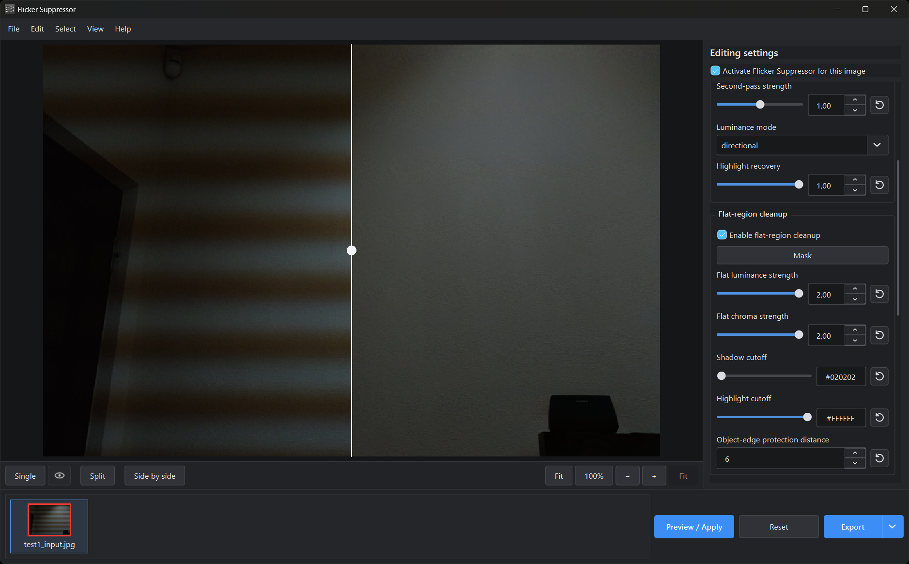
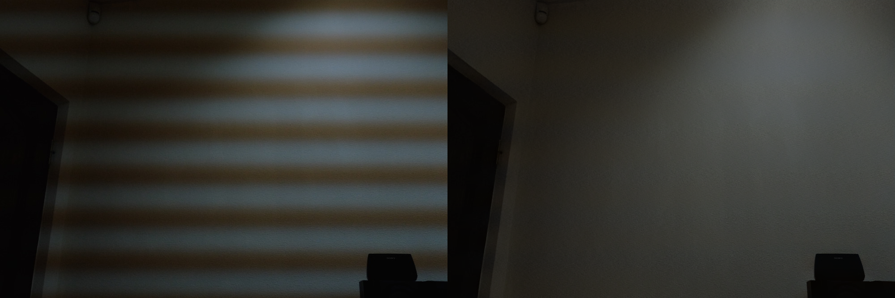

# **Flicker Suppressor** 🎨

Single-image/batch restoration for rolling-shutter flicker/banding under temporally modulated artificial lighting. This tool combines a Restormer-based luminance correction estimator, a dedicated two-channel chroma branch, orientation-aware processing, deterministic cleanup for difficult residual bands, and per-stage GUI paint masks.

Flicker Suppressor runs locally. Images are not uploaded anywhere by the program.

The project includes a PySide6 desktop application for interactive single-image and batch workflows, plus the full command-line interface for scripting, batch processing, and advanced parameters.



## Example

**Severe rolling bands caused by PWM LED driver:**


## What it is designed to fix

Flicker Suppressor targets spatial rolling-shutter artifacts caused by artificial lights whose output changes while the sensor is being read, including:

- horizontal or vertical brightness bands;
- green/magenta/blue/yellow chromatic band shifts;
- severe high-contrast periodic bands;
- faint residual row/column banding after the neural restoration pass;
- broad/few-cycle residual bands on large surfaces.

It is **not** intended as a general JPEG-debander, posterization remover, moire remover, fixed-pattern-noise remover, or temporal video-deflicker tool.

## System requirements

### Runtime dependencies

- *none*

### Windows build dependencies

- Python >= v3.12
- [**Microsoft Visual Studio 2022 Build Tools**](https://visualstudio.microsoft.com/vs/older-downloads/?utm_source=chatgpt.com)

In the Microsoft Visual Studio 2022 Build Tools installer, select Desktop development with C++ and make sure these components are included:
- MSVC v143 - VS 2022 C++ x64/x86 build tools
- Windows 11 SDK — the newest offered version is fine
- C++ core/build tools

### Tested configuration

The current release has been developed and validated primarily on Windows 11 25H2 with:

- Python 3.12;
- PyTorch 2.9.1 + CUDA 12.8 wheel (`torch==2.9.1+cu128`);
- NVIDIA RTX 5090 Mobile GPU;
- `numpy==1.26.4`;
- `Pillow==10.4.0`;
- `einops==0.8.0`;
- `PySide6==6.8.3` for the desktop GUI.

A recent NVIDIA driver is required for CUDA GPU mode. CPU mode is supported but substantially slower. The code also contains an Apple MPS path and is likely portable to ROCm builds that expose the PyTorch `torch.cuda` interface, but those paths have not been validated to the same level as NVIDIA CUDA. Intel XPU is not supported by this release.

The portable Windows build produced by `build_windows.ps1` bundles Python, Qt/PySide6, PyTorch, the model files, and the required runtime libraries; an end user of that standalone folder does not need a separate Python or Qt installation.

## GUI development and Windows build

### Desktop GUI dev mode

For source/development use on Windows:

```powershell
Set-ExecutionPolicy -Scope Process Bypass
.\run_gui_dev.ps1
```

The launcher creates `.venv-gui` when needed, installs the tested CUDA PyTorch build plus the GUI requirements, and starts `gui_main.py`.

On startup, Flicker Suppressor shows a lightweight centered splash before importing the heavier GUI/PyTorch/CUDA application modules. It uses the application logo with a separate bold white **`loading...`** label below it and a blurred dark text shadow for readability over bright desktop content. The splash has no artificial minimum duration and closes as soon as the main window is ready.

### Build

```powershell
Set-ExecutionPolicy -Scope Process Bypass
.\build_windows.ps1
```

The standalone folder is produced under `build\gui_main.dist`. See `GUI_BUILD.md` for the build workflow.

## Testing in Python

Create a virtual environment if desired:

```powershell
python -m venv .venv
.\.venv\Scripts\Activate.ps1
```

### NVIDIA GPU - tested PyTorch build

```powershell
python -m pip install --upgrade pip
python -m pip install torch==2.9.1 --index-url https://download.pytorch.org/whl/cu128
python -m pip install -r .\requirements.txt
```

`torchvision` and `torchaudio` are not required by Flicker Suppressor.

CUDA FP16 autocast (AMP) is enabled by default when the resolved device is CUDA. Use `--no-amp` for an FP32 comparison. On CPU/MPS the AMP flag has no effect.

On multi-GPU systems, choose a specific visible NVIDIA GPU with an indexed device such as `--device cuda:0` or `--device cuda:1`. The desktop Device dropdown enumerates CUDA GPUs by model name and labels the hardware selected by Auto.

### CPU-only

```powershell
python -m pip install --upgrade pip
python -m pip install torch==2.9.1 --index-url https://download.pytorch.org/whl/cpu
python -m pip install -r .\requirements.txt
```

Verify PyTorch:

```powershell
python -c "import torch; print(torch.__version__); print(torch.cuda.is_available()); print(torch.cuda.get_device_name(0) if torch.cuda.is_available() else 'CPU')"
```

## CLI quick start

Basic one-pass restoration:

```powershell
python .\hybrid_infer_detail_preserving.py `
    --input .\photo.jpg `
    --output .\photo_restored.png `
    --luma-model .\models\y.pth `
    --chroma-model .\models\chroma.pth `
    --device cuda `
    --amp
```

`--band-axis auto` is the default. Output is written as PNG.

### Deterministic cleanup without Restormer

If the neural correction is unhelpful for a particular image (like one with PWM lights), disable it completely. The model files are not loaded or required in this mode:

```powershell
python .\hybrid_infer_detail_preserving.py `
    --input .\photo.jpg `
    --output .\photo_restored.png `
    --no-restormer `
    --flat-profile `
    --flat-profile-mode pwm
```

The GUI exposes the same choice as **Enable Restormer correction**. For new images and after a GUI settings reset, this checkbox is **off by default**; the CLI keeps Restormer enabled by default for backward compatibility. When the GUI checkbox is off, Restormer-only controls are greyed out; **Band direction** remains editable because the deterministic cleanup stages still use the same orientation.

The first pass also has separate **First-pass luminance strength** and **First-pass chroma strength** controls (`--first-pass-luma-strength` and `--first-pass-chroma-strength`, both default `1.0`) when Restormer is enabled.

## Essential editing settings (beta)

When an image is imported, Flicker Suppressor can analyse it and fill in the settings that have to be right before any other tuning matters:

- **Band direction** — which way the bands run;
- **Band period** — the fundamental spacing of the bands;
- whether the **Residual profile** stage should run, and in which mode.

Everything else stays at its defaults. Toggle the feature from **Edit → Essential editing settings**; it is on by default and the choice is remembered.

**This is a beta feature and its scope is deliberately narrow.** It determines four settings out of roughly 120. It does not choose strengths, pass counts, or safety thresholds — those still depend on the image and your judgement. Finding the essential settings is not the same as restoring the image: it points the correction at the right frequency on the right axis, and the rest of the work is still yours.

The analysis measures the band on log-channel ratios rather than luminance alone. Scene structure is multiplicative and largely cancels in a ratio, while a flicker source with a different spectrum from the ambient light does not — so the band stands out much more clearly, and periods that luminance reports as a harmonic are often resolved correctly. Every candidate is then cross-checked across several search windows and several ratios; a period that changes when the search window changes is treated as undetermined rather than reported as a result.

The agreement rule is deliberately strict. It will decline on some images it could have handled rather than risk a confident wrong answer. When it declines, that image is reset to defaults and a notice appears the first time you select it. Greyscale images are capped at medium confidence, because with no colour ratios there is no second opinion to check luminance against.

**Band period** is a dropdown offering **Auto**, each detected candidate, and **Custom…**. Candidates show their cycle count and are marked as harmonics or independent alternatives — mistaking a second harmonic for the fundamental is the most common way period detection goes wrong, so the alternatives are one click away. **Custom…** enables the numeric field.

While the analysis runs the window is covered by a progress overlay, but dragging more images onto the canvas or the filmstrip still works, so a further import can be queued.

The same analysis is available from the command line and writes a JSON recipe:

```powershell
python .\autosettings.py --input .\photo.jpg --json .\photo.settings.json
```

Add `--base defaults.json` to merge the estimate into a complete recipe rather than emitting only the estimated keys. The exit code is `2` when confidence is too low to use.

### Strong/severe bands

Use a second pass when one pass leaves obvious residual bands:

```powershell
python .\hybrid_infer_detail_preserving.py `
    --input .\photo.jpg `
    --output .\photo_restored.png `
    --luma-model .\models\y.pth `
    --chroma-model .\models\chroma.pth `
    --passes 2 `
    --flat-filter `
    --device cuda `
    --amp
```

### Faint residual bands on textured surfaces

```powershell
python .\hybrid_infer_detail_preserving.py `
    --input .\photo.jpg `
    --output .\photo_restored.png `
    --luma-model .\models\y.pth `
    --chroma-model .\models\chroma.pth `
    --flat-profile `
    --flat-profile-luma-strength 0.50 `
    --flat-profile-chroma-strength 0.50 `
    --device cuda `
    --amp
```

For exceptionally strong fine periodic bands, values around `0.8-1.2` can be useful. Increase gradually. Values above `1.0` can intentionally over-apply the estimated residual correction on textured/foreground regions; when Flat-region cleanup is also active, the dominant-surface handoff caps that over-application on the main large smooth background surface.

Residual-profile correction is spatially adaptive by default: Flicker Suppressor still estimates one robust global band period/phase/waveform, then fits only a slowly varying local amplitude from the band-limited residual that matches that waveform. The current default is attenuation-only (`max gain = 1.0`), which lets weakly supported regions receive less correction without silently exceeding the user's selected profile strength. The no-harm validator is band-coherent: it may vary only along the band direction, so it can reject a harmful scene zone without drawing 2-D object silhouettes into the profile correction.

For strobed/PWM LED lighting whose residual bands have square-ish plateaus and sharper transitions, Residual Profile also offers **PWM / Step** mode. Auto timing is **fundamental-first**: the residual image is converted into a scene-resistant row/column transition signal, autocorrelation peaks are compared as a family, and near-tied large multiples are rejected in favor of the shortest recurrent candidate that still has enough visible cycles and two opposite repeated PWM transitions. This avoids assigning a large harmonic or an autocorrelation plateau in place of the real period. The detected period is then refined against phase drift across the frame, which matters most on images with many visible cycles, where an error under one percent is enough to lose most of the correction. A manual Profile period remains exact and bypasses Auto selection.

When Restormer is enabled, its cumulative source-to-post-neural correction is available as an additional timing/validation cue only; its magnitude is never blindly reapplied. When Restormer is disabled or contributes little useful PWM evidence, PWM / Step can lock directly from the visible residual image. A strongly coherent single source uses a **global phase lock with local radiometric amplitude fitting**. More ambiguous scenes can use the multi-period/multi-surface path, which groups harmonic-related candidates, jointly fits independent validated period families, and lets coherent surfaces carry different local source amplitudes without giving every region an unconstrained phase.

An optional **Final PWM polish** runs after the normal profile/local cleanup. It does not search for any new frequency: it reuses only already-validated PWM period families, measures the remaining exact-mode energy, and accepts extra passes only when the known PWM component decreases without an excessive increase in nearby control frequencies. The stage stops when the remaining residual is no longer phase-coherent with the band, so the maximum pass count is an upper bound rather than a value that needs tuning per image. The GUI exposes the polish only for **PWM / Step**; its checkbox/strength/pass controls are greyed out in **Smooth periodic** mode. In PWM mode use **Enable final PWM polish**; CLI equivalent:

```powershell
--flat-profile `
--flat-profile-mode pwm `
--flat-profile-pwm-polish `
--flat-profile-pwm-polish-strength 1.0 `
--flat-profile-pwm-polish-passes 2
```

### Tone restoration

The neural passes compress the tonal range: shadows lift and highlights compress. This is a global change rather than a band, so none of the band-focused cleanup stages can see or repair it. **Tone restoration** runs at the end of the pipeline and puts the contrast and gamma back.

It is on by default. The GUI exposes it under **Tone restoration** as a checkbox and **Restoration strength** (default `1.00`); `1.00` matches the original image's tone most closely, and lower values apply a proportionally smaller correction. CLI equivalents:

```powershell
--tone-restore `
--tone-restore-strength 1.0
```

Use `--no-tone-restore` to disable the stage.

The correction is fitted on band-axis-smoothed envelopes and applied as a smooth offset in log space, so the periodic residual passes through unchanged — a tone curve applied directly to a still-banded image would re-expand the very bands the earlier stages removed. Positive corrections are also limited by remaining highlight headroom, so restoring contrast cannot drive near-white detail into clipping.

Two further options exist on the command line but are not shown in the desktop panel, because neither is useful for ordinary images: `--tone-restore-max-gain` is a safety clamp that normal photographs do not approach, and `--tone-restore-min-confidence` selects which period the stage smooths with rather than whether it runs.

### Very broad residuals

```powershell
--flat-surface-equalizer
```

Broad residual cleanup has two modes. The default is now `consensus` (**Multi-surface consensus**), intended for cases where the same very broad luminance and/or chroma residual appears across multiple unrelated surfaces. `dominant` remains available for the older one-large-surface equalizer. With Restormer enabled, the consensus path can use cumulative Restormer Y and Cb/Cr changes only as validation evidence, then measures the remaining broad waveforms independently across several scene regions. With Restormer disabled, luminance consensus still has an image-only cross-region fallback; consensus chroma is conservatively withheld without a neural chroma direction hint. When neural hints are available, guided luminance specifically looks for an under-corrected residual opposite to the neural gain, while chroma accepts a strong vector relationship in either sign so it can also remove an overshot/model-introduced color cast. This lets it recover sub-cycle / single-trough residuals that are too broad for the normal periodic profile:

```powershell
--flat-surface-equalizer `
--flat-surface-equalizer-mode consensus
```

The desktop GUI exposes the same choice as **Broad mode** under **Broad residual cleanup**, together with **Broad luminance strength** and **Broad chroma strength** (both default 1.00, range 0-2). In consensus mode each strength is a maximum authority: the no-harm fit may use less correction when the evidence does not support the full requested value. After a luminance consensus has already been validated, one automatic low-authority refinement pass can re-measure a small remaining copy of the same broad waveform; it has no separate GUI control and is capped to 35% extra authority with its own same-waveform/no-harm validation. Both modes use the existing Broad paint mask as a final application gate. See `DOCUMENTATION.md` before enabling broad cleanup routinely.

## Developer settings JSON

The desktop **Export/import settings (dev)** section provides two stacked buttons: **Export json** followed by **Import json**. Export writes the current image's complete processing recipe, including GUI-hidden parser defaults, while excluding machine-specific paths and painted mask pixels.

Import accepts Flicker Suppressor processing-settings JSON only. The file is parsed and validated before any setting is changed: unknown keys, wrong JSON types, invalid enum choices, non-finite numbers, out-of-range GUI values, malformed RGB cutoff colors, and an invalid Shadow/Highlight ordering are rejected with an error. Older or partial exports are supported when they contain only known settings; missing fields are filled from the current defaults. Import applies to the current activated image, marks its preview stale so the next Preview/Export recomputes it, and preserves any authored cleanup masks because masks are not part of the developer JSON.

## Batch processing

`--input` may be a single image or a directory. Directory input is searched recursively for:

`.png`, `.jpg`, `.jpeg`, `.bmp`, `.tif`, `.tiff`, `.webp`.

Example:

```powershell
python .\hybrid_infer_detail_preserving.py `
    --input .\input_photos `
    --output .\restored_photos `
    --luma-model .\models\y.pth `
    --chroma-model .\models\chroma.pth `
    --device cuda `
    --amp
```

The source directory structure is preserved and all outputs are written as PNG. Existing outputs are skipped unless `--overwrite` is used.

## Recommended presets

| Situation | Suggested options |
|---|---|
| Normal case | defaults; CUDA AMP is on automatically (`--no-amp` forces FP32) |
| Neural pass changes luminance/chroma too much | tune `--first-pass-luma-strength` and `--first-pass-chroma-strength` separately |
| Unsure which band direction/period an image needs | let **Essential editing settings** analyse it on import, or run `autosettings.py` from the CLI |
| Restormer is useless for the PWM pattern | `--no-restormer --flat-profile --flat-profile-mode pwm` |
| Severe bands | `--passes 2 --flat-filter` |
| Faint residual bands / textured wall | `--flat-profile --flat-profile-luma-strength 0.50 --flat-profile-chroma-strength 0.50` |
| Very fine strong periodic bands | previous preset + raise profile strengths; optionally force `--flat-profile-band-period` |
| Sharp square/PWM LED stripes | `--flat-profile --flat-profile-mode pwm`; leave period on Auto first |
| Correct PWM period but faint bands remain | add `--flat-profile-pwm-polish --flat-profile-pwm-polish-strength 1.0 --flat-profile-pwm-polish-passes 4` |
| Result looks flatter/duller than the original | tone restoration is on by default; raise `--tone-restore-strength` toward `1.0`, or lower it if midtones look over-lifted |
| Auto period chooses incorrectly in an unusual frame | measure/force `--flat-profile-band-period`; manual periods are exact |
| Visible vertical bands | `--band-axis vertical` or Auto |
| Mixed horizontal + vertical residuals | add `--orthogonal-profile`; it is independent of the main `--flat-profile` switch |
| Very broad residual shared across the frame | `--flat-surface-equalizer` (default Broad mode: Multi-surface consensus) |
| Very broad few-cycle residual confined to one dominant surface | `--flat-surface-equalizer --flat-surface-equalizer-mode dominant` |
| Localized cleanup in the GUI | paint the corresponding Flat / Residual / Broad **Mask**; the mask gates only that stage's visible correction |
| Debugging masks/period detection | add `--debug-dir .\debug` |

## Documentation

See [`DOCUMENTATION.md`](DOCUMENTATION.md) for:

- desktop GUI workflow, per-image activation, selection/current-image semantics, per-stage paint masks, export behavior, and settings validation;
- architecture and processing flow;
- Y/CbCr separation;
- correction-field mathematics;
- orientation handling;
- flat-filter/profile/equalizer internals;
- detailed explanation of **every inference command-line option**;
- troubleshooting and tuning examples.

## Limitations

- This is a single-image restoration system; it cannot use temporal information from adjacent video frames.
- Very broad real illumination gradients can be mathematically ambiguous with extremely low-frequency flicker.
- Auto orientation uses a physical aspect-ratio prior for ordinary portrait/landscape images. Manually rotated/cropped files can require `--band-axis horizontal` or `vertical`.
- Aggressive local flattening can alter legitimate smooth surfaces if safety thresholds are relaxed too far.
- Aggressive profile strengths can overcorrect real row/column illumination variation; the high-strength guards reduce common failures but cannot prove that every scene variation is flicker.
- Multiple PWM sources with different periods/phases can be decomposed only when the single image contains enough independent evidence. Exact harmonic relationships, very few visible cycles, clipping, or scene structure aligned with the same period/phase can remain ambiguous.
- Painted GUI cleanup masks are session/per-image editing data; they are used for preview/export but are not serialized into, or replaced by, developer settings JSON import/export.
- Current GUI and CLI exports are 8-bit RGB PNG; original RAW/high-bit-depth image metadata is not preserved.
- **Essential editing settings is beta.** It determines band direction, band period and the residual cleanup mode only; strengths, pass counts and safety thresholds are not estimated, and a successful analysis does not mean the image is restored. It declines rather than guessing when the evidence is ambiguous, and it will sometimes decline on images it could have handled.
- Settings JSON files written before this version contain highlight-recovery keys and will be rejected on import. Remove `highlight_recovery_strength`, `highlight_recovery_start` and `highlight_recovery_full`, or re-export the recipe.

## License and third-party software

Flicker Suppressor is released under the Apache License 2.0. See `LICENSE`.

Third-party notices are kept separately for development/source use and for the frozen Windows release:

- `LICENSE-THIRD-PARTY` - development/source-tree third-party notices;
- `RELEASE-LICENSE-THIRD-PARTY` - release-specific notices and license texts for the bundled Windows portable build.

Important upstream projects:

- Restormer: https://github.com/swz30/Restormer - MIT License.
- BurstDeflicker: https://github.com/qulishen/BurstDeflicker - Apache License 2.0.
- BasicSR: https://github.com/XPixelGroup/BasicSR - Apache License 2.0.

## Research attribution

BurstDeflicker:

```bibtex
@inproceedings{BurstDeflicker_lishenqu,
  title={BurstDeflicker: A Benchmark Dataset for Flicker Removal in Dynamic Scenes},
  author={Qu, Lishen and Liu, Zhihao and Zhou, Shihao and Luo, Yaqi and Liang, Jie and Zeng, Hui and Zhang, Lei and Yang, Jufeng},
  booktitle={Advances in Neural Information Processing Systems},
  year={2025}
}
```

Restormer:

```bibtex
@inproceedings{Zamir2021Restormer,
  title={Restormer: Efficient Transformer for High-Resolution Image Restoration},
  author={Syed Waqas Zamir and Aditya Arora and Salman Khan and Munawar Hayat and Fahad Shahbaz Khan and Ming-Hsuan Yang},
  booktitle={CVPR},
  year={2022}
}
```

---

*Last Updated: 26 August 2026*
